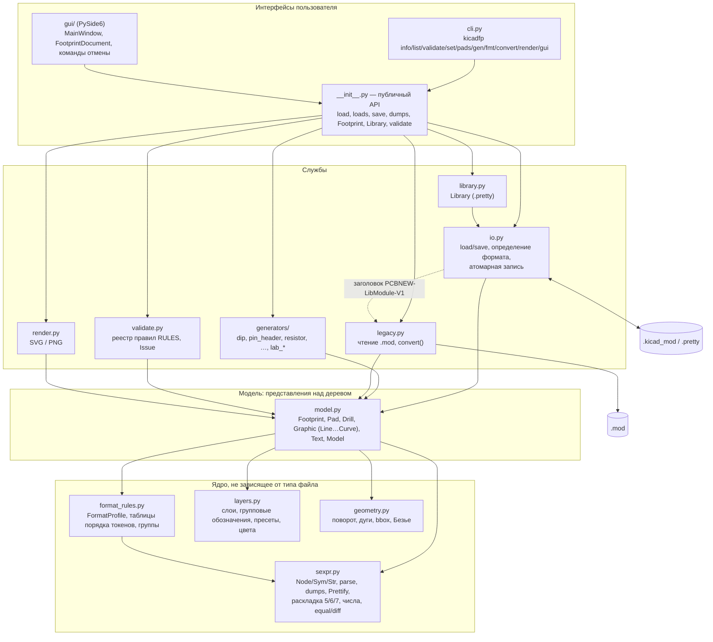
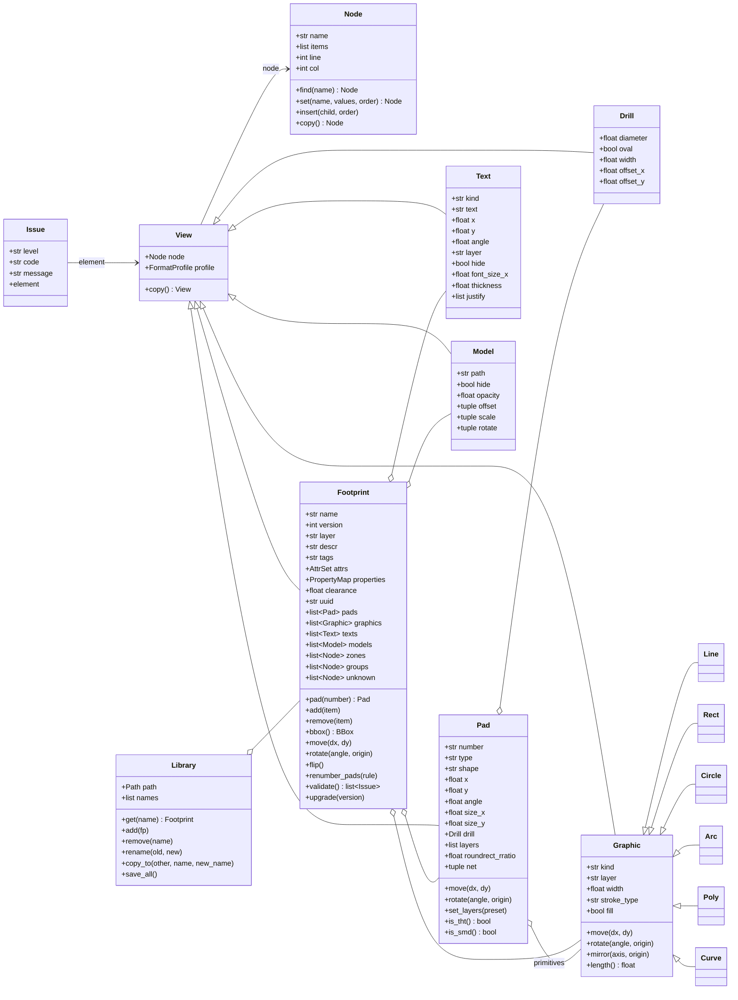
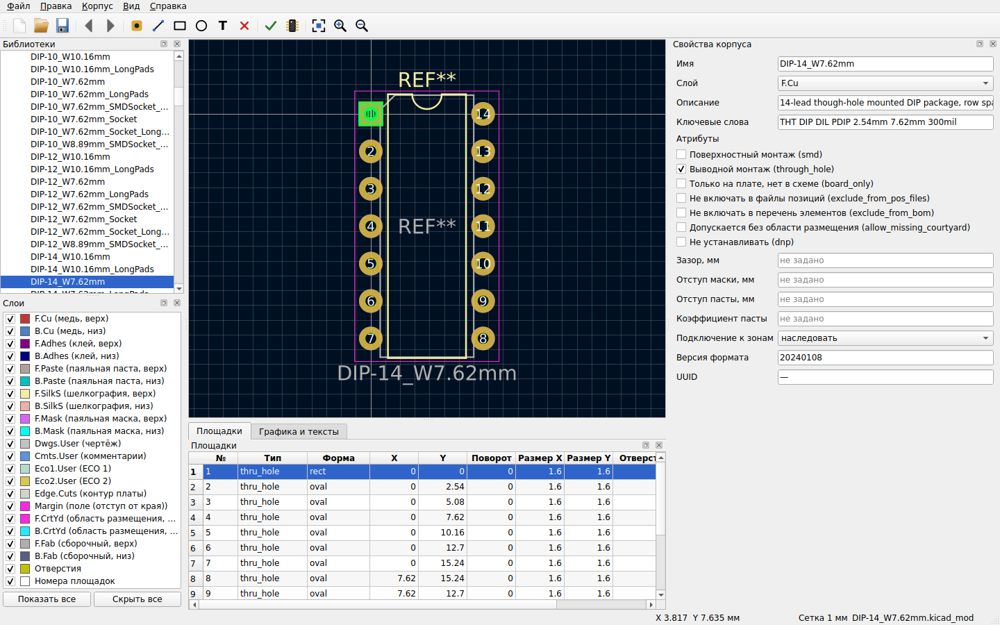

# Описание программы

**«Библиотека и редактор файлов KiCad на языке Python» (kicadfp). Этап 1: посадочные места**

| | |
|---|---|
| Документ | Описание программы (структура — по ГОСТ 19.402-78) |
| Версия программы | 0.1.0 (`kicadfp/_version.py`, `kicadfp --version`) |
| Основание | Техническое задание (`refs/tz/tz_text.txt`), раздел 5 |
| Заказчик | кафедра САПР ВС РГРТУ |
| Исполнитель | студент группы 346 Хорьков К. А. |

Документ описывает назначение, логическую структуру, модель данных, алгоритмы, форматы входных и
выходных данных программы. Как установить и работать с программой, написано в руководстве
пользователя, API и правила расширения — в руководстве программиста, порядок проверки — в
программе и методике испытаний. Все примеры кода и команд в документе выполнены на версии 0.1.0
из корня репозитория, приведённые результаты получены этими запусками.
Генераторы дают детерминированные `uuid`, а у элементов, созданных иначе, `uuid` при каждом запуске новые.

---

## 1 Общие сведения

### 1.1 Обозначение и наименование

Наименование: «Библиотека и редактор файлов KiCad на языке Python». Рабочее обозначение и имя
пакета Python: **kicadfp**. Номер версии задаётся по схеме семантического версионирования
`major.minor.patch` в файле `kicadfp/_version.py` (`__version__ = "0.1.0"`) и выводится командой
`kicadfp --version`.

Этап 1 охватывает один тип сущностей KiCad: посадочные места (footprints), то есть файлы
`.kicad_mod`, библиотеки-каталоги `.pretty` и старые библиотеки `.mod`. Последующие этапы
(символы, схемы, платы, правила, проекты; ТЗ, п. 7.2) в эту версию не входят. Архитектура этапа 1
их не исключает (см. 3.1 и 3.5).

### 1.2 Языки программирования

| Часть | Язык, технология |
|---|---|
| Ядро: разбор, модель, запись, проверка, генераторы, конвертер `.mod`, SVG, командная строка | Python ≥ 3.10, только стандартная библиотека |
| Графический интерфейс, экспорт PNG | Python + PySide6 ≥ 6.5 (Qt 6) |
| Тесты | Python, pytest, pytest-cov, pytest-qt |
| Документация | Markdown (диаграммы — Mermaid) |

Идентификаторы в коде английские. Строки документации, комментарии и все сообщения
(командная строка, графический интерфейс, замечания проверки) написаны по-русски.

### 1.3 Программное обеспечение, необходимое для функционирования

| ПО | Назначение | Обязательность |
|---|---|---|
| Python 3.10–3.13 (CPython) | исполнение программы | обязательно |
| pip | установка пакета (wheel, sdist или каталог с исходным кодом) | обязательно для установки |
| PySide6 ≥ 6.5 | графический интерфейс (`kicadfp gui`, `kicadfp-gui`) и экспорт PNG (`render … -o *.png`) | необязательно, extras `gui` / `png` |
| pytest ≥ 7, pytest-cov, pytest-qt | запуск автоматических тестов | необязательно, extras `dev` |
| KiCad 8/9 (`kicad-cli`) | внешняя проверка совместимости в тестах `tests/test_kicad_cli.py` | необязательно, программа KiCad не использует |
| ОС | Windows 10/11, Linux (glibc ≥ 2.31), macOS 12+ (ТЗ 4.5.2) | — |

Ядро не импортирует PySide6 и не использует модуль `pcbnew` из KiCad (ТЗ 4.5.4). Поэтому его
можно запускать без установленной САПР, в том числе из встроенного Python самой KiCad.

---

## 2 Функциональное назначение

Программа предназначена для работы с файлами посадочных мест KiCad вне самой САПР. Она читает
файлы, изменяет их из скриптов, из командной строки и из графического интерфейса и сохраняет
результат в формате, который без ошибок открывает KiCad. Функции (ТЗ 3.1, 4.1):

1. **Чтение.** Программа читает файлы `.kicad_mod` в формате S-выражений KiCad 5
   (корень `module`), 6, 7, 8, 9 и 10 (ночные сборки, версия `20260206`), библиотеки-каталоги
   `.pretty` и старые библиотеки `PCBNEW-LibModule-V1` (`.mod`, `.emp`, только чтение). По
   файлу строится объектная модель корпуса. Если в файле синтаксическая ошибка, программа
   сообщает номер строки и позицию и не создаёт модель.
2. **Просмотр и изменение** всех свойств корпуса, текстов, графики, площадок и 3D-моделей через
   API (`import kicadfp`), командную строку (`kicadfp set …`) и графический интерфейс.
   Поддерживаются групповые операции над площадками: перенумерация по правилу, сдвиг, поворот
   вокруг точки, смена слоёв, общий размер. Над корпусом выполняются сдвиг, поворот, перенос на
   другую сторону (flip) и перевод в новую версию формата (`upgrade`).
3. **Создание корпусов**, в том числе по параметрам. Генераторы: DIP, штыревые разъёмы,
   выводные резисторы, конденсаторы и диоды, радиальные конденсаторы, транзисторы TO-92,
   корпуса лабораторной работы `dip14`, `mlt`, `snp8`. Каждый генератор строит шелкографию,
   контур F.Fab и область размещения F.CrtYd.
4. **Сохранение без потерь (round-trip).** Неизвестные узлы и атрибуты, порядок узлов и
   исходная запись чисел сохраняются. Если файл открыт и не изменён, запись совпадает с
   исходной по дереву S-выражений. Для файлов, записанных самой KiCad, запись совпадает с
   исходной байт в байт. Для KiCad 5–7 из этого есть немногие исключения — ранние и ночные
   сборки (см. 3.4.2). Если изменён один элемент, в файле меняется только он. Запись атомарная.
5. **Проверка корректности.** 21 независимое правило с уровнями «ошибка» и «предупреждение»
   (ТЗ 4.1.5). Есть строгий режим: при ошибках файл не записывается.
6. **Работа с библиотеками `.pretty`:** перечисление корпусов, добавление, удаление,
   переименование, копирование между библиотеками.
7. **Преобразование старого формата** `.mod` в каталог `.pretty` с переводом единиц
   (децимилы → мм).
8. **Изображения** корпуса в форматах SVG (стандартная библиотека) и PNG (через PySide6), в
   цветах слоёв KiCad.

Эксплуатационное назначение (ТЗ 3.2): подготовка и массовое исправление библиотек
компонентов, учебный процесс по САПР печатных плат, скрипты автоматизации. Пользователи —
разработчики печатных плат, знающие KiCad, и авторы скриптов на Python.

Ограничения этапа 1:

* Зоны (`zone`), группы (`group`), размерные линии, изображения и прочие неизвестные программе
  узлы не редактируются типизированно. Они сохраняются без изменений и доступны как узлы
  дерева (`Footprint.zones`, `Footprint.groups`, `Footprint.unknown`).
* Запись в старый формат `.mod` не поддерживается.
* Файл с неизвестным токеном (например `(example_token 1 2)` из сценария Г.3 ТЗ) программа
  прочитает и сохранит без изменений, но сама KiCad такой файл не откроет: её парсер
  отвергает неизвестные токены. Сохранность узла проверяет сама программа.
* Программа не пишет конструкции, которых не знает версия формата файла (например
  `(attr dnp)` в файл KiCad 6). Вместо этого возникает `ValueError` с предложением выполнить
  `Footprint.upgrade()`. Версия файла — обещание, что KiCad этой версии его прочитает.

---

## 3 Описание логической структуры

### 3.1 Архитектура: дерево S-выражений и представления

Ключевое требование этапа — сохранение без потерь (ТЗ 4.1.4). Поэтому программа построена по
принципу «**дерево + представления (views)**»:

1. Файл целиком разбирается в дерево узлов `sexpr.Node`. Узел хранит имя и список элементов в
   исходном порядке. Элементы — атомы и подузлы. Атом `Sym` (голый токен) хранит **исходный
   текст** (`"1.60"`, `"-180.000000"`). Атом `Str` хранит строку из кавычек без экранирования.
2. Типизированные объекты `Footprint`, `Pad`, `Line`, `Text`… **не хранят копий данных**. У
   каждого есть ссылка `node` на свой узел. Каждый getter читает значение из узла, каждый
   setter меняет только свой токен в узле. Отсутствующий токен создаётся в форме, которую
   пишет KiCad этой версии формата, и вставляется по таблице порядка (3.4.3). Присваивание
   `None` удаляет необязательный токен.
3. При записи сериализуется всё дерево. Неизвестные узлы и атрибуты, порядок элементов и
   исходный текст неизменённых чисел выводятся как есть.

Отсюда следуют свойства, которые проверяют тесты (`tests/test_roundtrip.py`,
`tests/test_model_*.py`):

* неизменённый файл после записи совпадает с исходным по дереву. Файлы, записанные самой
  KiCad 8–10, совпадают байт в байт. Файлы KiCad 5–7 тоже совпадают байт в байт, кроме
  исключений, перечисленных в `tests/test_roundtrip.py` (см. 3.4.2);
* при изменении одного атрибута меняется ровно один токен.

Пример (фикстура KiCad 8, изменён размер одной площадки):

```python
import difflib, kicadfp
p = "tests/fixtures/kicad8/Package_DIP.pretty/DIP-14_W7.62mm.kicad_mod"
src = open(p, encoding="utf-8").read()
fp = kicadfp.load(p)
assert kicadfp.dumps(fp) == src          # без изменений — байт в байт
fp.pad("1").size_x = 2.0
print("".join(difflib.unified_diff(src.splitlines(True),
                                   kicadfp.dumps(fp).splitlines(True), n=0)))
```

```text
---
+++
@@ -231 +231 @@
-		(size 1.6 1.6)
+		(size 2 1.6)
```

Схема архитектуры (стрелки показывают, какой модуль какой использует):



Графический интерфейс тоже меняет модель только через представления. Каждое изменение
оформляется командой отмены `QUndoCommand`, которая применяется через
`FootprintDocument.apply()`. Команда хранит снимки изменённых узлов дерева до и после
операции. Поэтому после отмены текст файла совпадает с исходным байт в байт, а число шагов
отмены ограничено значением 1000 (ТЗ 4.2.2 требует не менее 100).

### 3.2 Структура пакета

Размеры модулей даны в строках исходного текста на 28.09.2026.

| Модуль | Строк | Назначение |
|---|---:|---|
| `kicadfp/__init__.py` | 65 | Публичный API: `load`, `loads`, `save`, `dumps`, классы модели, `BBox`, `Library`, `Issue`, `validate` (функция), `SexprSyntaxError`, `ValidationError`, подмодули `generators`, `legacy`, `render`, `__version__`. PySide6 не импортирует. |
| `kicadfp/__main__.py` | 10 | Запуск `python -m kicadfp …` (вызывает `cli.main`). |
| `kicadfp/_version.py` | 3 | Номер версии `__version__`. |
| `kicadfp/sexpr.py` | 1651 | Дерево S-выражений, независимое от типа файла: `Sym`, `Str`, `Node` (навигация, `set`/`insert` по таблице порядка, флаги, копирование). `parse`/`parse_all` с позициями ошибок (`SexprSyntaxError`). `dumps` в стилях `kicad8` (Prettify), `kicad7`, `kicad6`, `kicad5`, `compact`, `auto`. Форматирование чисел (`format_number`, `format_angle`, `format_double`) и строк (`quote`/`unquote`). Сравнение деревьев `equal` и `diff`. |
| `kicadfp/format_rules.py` | 549 | Таблицы правил на тип узла (ТЗ 7.3): порядок дочерних токенов (`FOOTPRINT_ORDER`, `PAD_ORDER`, `TEXT_ORDER`, `GRAPHIC_ORDER`, `MODEL_ORDER`, `EFFECTS_ORDER`, `FONT_ORDER`, `STROKE_ORDER`, `DRILL_ORDER`, `ATTR_ORDER`), группы элементов корпуса (`GROUPS`, `insert_in_group`), ключ сортировки секции рисования, профили версий `FormatProfile`/`profile_for`, `DEFAULT_VERSION`, `kicad_format_version`. |
| `kicadfp/layers.py` | 791 | Слои KiCad: канонические имена (96 слоёв, `ALL_LAYERS`), групповые обозначения (`*.Cu`, `F&B.Cu`, `*.Mask`…), пресеты слоёв площадок, цвета темы KiCad, порядок отрисовки, старая нумерация и маски `.mod`, `is_valid_layer`, `expand`, `flip_layer`. |
| `kicadfp/geometry.py` | 298 | Геометрия без зависимостей: поворот точки как `RotatePoint` KiCad, дуга по трём точкам ↔ центр/радиус/углы, кривые Безье, габариты `BBox`. |
| `kicadfp/model.py` | 6358 | Представления над узлами: `View`, `Footprint`, `Pad`, `Drill`, `Graphic` и `Line`, `Rect`, `Circle`, `Arc`, `Poly`, `Curve`, `Text`, `Model`. Вспомогательные `AttrSet` (множество `attr`) и `PropertyMap` (словарь `property`). Приведение узлов к версии корпуса, `Footprint.upgrade()`. |
| `kicadfp/io.py` | 312 | `load`/`loads` с определением формата (S-выражение или старый `.mod`), `save`/`dumps`. Атомарная запись: временный файл, `fsync`, `os.replace`. UTF-8 без BOM, LF. Классы `ValidationError`, `LegacyLibraryError`. |
| `kicadfp/legacy.py` | 1521 | Чтение `PCBNEW-LibModule-V1` (`read_library`, `loads_library`), `convert()` в `.pretty`, режимы `compat="kicad9"` / `"fixed"`, `LegacyFormatError`, `LegacyIssue`. |
| `kicadfp/library.py` | 446 | `Library` — каталог `.pretty`: `names`, `list`, `get` (с кэшем), `add`, `save`, `save_all`, `remove`, `rename`, `copy_to`, `validate_all`. Нормализация имён `sanitize_name`. |
| `kicadfp/validate.py` | 724 | `Issue`, реестр правил `RULES` и декоратор `@rule(code, level)`, `validate()`, `has_errors()`, 21 правило. |
| `kicadfp/render.py` | 751 | `render_svg`, `save_svg` (стандартная библиотека), `save_png` (PySide6). |
| `kicadfp/cli.py` | 2255 | Командная строка (argparse): `info`, `list`, `validate`, `set`, `pads`, `gen`, `fmt`, `convert`, `render`, `gui`, `--version`. Коды возврата 0/1/2. |
| `kicadfp/generators/__init__.py` | 301 | Реестр `GENERATORS`, синонимы `ALIASES`, `describe`, `from_json`, `coerce_param`, `target_version`, `current_version`. |
| `kicadfp/generators/_common.py` | 679 | Общие построители: новый корпус с Reference/Value, ряды площадок, монтажные отверстия, контуры, дуги, область размещения с округлением к сетке 0,01 мм, обрезка шелкографии у площадок, `finalize` (порядок узлов как у KiCad 9, детерминированные `uuid5`). |
| `kicadfp/generators/dip.py`, `pin_header.py`, `axial.py`, `radial.py`, `transistor.py` | 126–173 | Семейства корпусов по геометрии библиотеки KiCad (KLC). |
| `kicadfp/generators/lab.py` | 235 | Корпуса лабораторной работы `lab_dip14`, `lab_mlt`, `lab_snp8`. |
| `kicadfp/gui/__init__.py` | 163 | `main()`. Ленивый импорт PySide6: без него выводится понятное сообщение. |
| `kicadfp/gui/app.py` | 288 | Создание `QApplication`: стиль Fusion, светлая или тёмная тема, русский перевод Qt, локаль с десятичной точкой. |
| `kicadfp/gui/document.py` | 543 | `FootprintDocument` — единственный владелец модели в GUI: путь, стек отмены (`undoLimit` 1000), выделение, сигналы `changed`, `selection_changed`, `modified_changed`… |
| `kicadfp/gui/commands.py` | 999 | Команды отмены и повтора по снимкам узлов: `SetAttrCommand`, `SetAttrsCommand`, `AddItemCommand`, `RemoveItemCommand`, `OperationCommand`, `ReplaceNodeCommand`, `BatchCommand`. |
| `kicadfp/gui/canvas.py` | 1343 | `PreviewCanvas` (`QGraphicsView`): сцена в миллиметрах, слои в цветах KiCad, сетка, масштаб, выбор и перетаскивание элементов. |
| `kicadfp/gui/pad_table.py`, `items_table.py`, `props_panel.py` | 827, 326, 340 | Таблица площадок, таблица графики и текстов, панель свойств корпуса. |
| `kicadfp/gui/libtree.py` | 706 | Дерево библиотек `.pretty`: открыть, переименовать, удалить, копировать. |
| `kicadfp/gui/dialogs.py` | 1710 | Диалоги: генерация, проверка, групповые операции над площадками, свойства элемента, «О программе». |
| `kicadfp/gui/mainwindow.py` | 2369 | `MainWindow`: меню, панель инструментов, док-панели, строка состояния, настройки. |

Вне пакета: `tests/` (автоматические тесты и фикстуры, 2533 файла `.kicad_mod` и
`legacy_mod/My_lib.mod`), `scripts/` (отчёт о приёмке), `docs/` (документация,
`docs/dev/` — внутренние спецификации формата), `pyproject.toml`.

### 3.3 Модель данных

#### 3.3.1 Общие правила

* Единицы: миллиметры и градусы. Система координат KiCad: ось X вправо, ось Y вниз.
  Положительный угол в файле означает поворот против часовой стрелки на экране.
* Слои хранятся строками KiCad (`F.Cu`, `F.SilkS`, `User.1`…) и групповыми обозначениями
  (`*.Cu`, `*.Mask`). Проверка сверяет их со списком `layers.ALL_LAYERS` и
  `layers.WILDCARDS`.
* Каждое представление является наследником `View` и хранит `node` (свой узел) и `profile`
  (профиль версии формата). Профиль берётся у родительского корпуса. У отдельно созданного
  элемента профиль KiCad 9, и `Footprint.add()` приводит его узел к профилю корпуса.
  Например, в корпус KiCad 6 линия добавляется с `(width …)` и `tstamp`, а не со `stroke` и
  `uuid`.
* Представления равны, если они одного класса и ссылаются на один и тот же узел.
* Коллекции `pads`, `graphics`, `texts`, `models` вычисляются при каждом обращении. Результат —
  новый список представлений над текущими узлами в порядке файла.

#### 3.3.2 Классы модели (фактическая реализация; соответствует таблице Б.1 ТЗ)

Таблица 1 — Классы модели корпуса

| Класс | Атрибуты (свойства) | Методы |
|---|---|---|
| `View` (базовый) | `node`, `profile`, `parent` | `copy()` |
| `Footprint` | `name`, `version`, `generator`, `generator_version`, `layer`, `descr`, `tags`, `attrs` (`AttrSet`, множество), `properties` (`PropertyMap`, словарь), `clearance`, `solder_mask_margin`, `solder_paste_margin`, `solder_paste_ratio`, `zone_connect`, `thermal_width`, `thermal_gap`, `autoplace_cost90`, `autoplace_cost180`, `uuid` (`uuid` или `tstamp`), `locked`, `placed`, `tedit`, `path`, `sheetname`, `sheetfile`, `private_layers`, `net_tie_pad_groups`, `at`, `reference`, `value` (тексты `Text`). Коллекции (только чтение): `pads`, `graphics`, `texts`, `fields`, `models`, `zones`, `groups`, `unknown` (узлы, неизвестные программе) | `new(name, …)` (класс), `pad(number)`, `pads_by_number()`, `add(item)`, `remove(item)`, `new_pad`, `new_line`, `new_rect`, `new_circle`, `new_arc`, `new_poly`, `new_curve`, `new_text`, `new_model`, `bbox(layers, include_texts, include_pads)`, `move(dx, dy)`, `rotate(angle, origin)`, `flip()`, `renumber_pads(rule, start, order, …)`, `validate(strict)`, `to_sexpr()`, `dumps()`, `copy()`, `upgrade(version)` |
| `Pad` | `number`, `type` (`thru_hole`, `smd`, `connect`, `np_thru_hole`), `shape` (`circle`, `rect`, `oval`, `trapezoid`, `roundrect`, `custom`), `x`, `y`, `position`, `angle`, `size_x`, `size_y`, `size`, `drill` (`Drill` или `None`), `layers`, `roundrect_rratio`, `chamfer_ratio`, `chamfer`, `rect_delta`, `net` (номер, имя), `pinfunction`, `pintype`, `property`, `clearance`, `solder_mask_margin`, `solder_paste_margin`, `solder_paste_ratio`, `zone_connect`, `thermal_bridge_width`, `thermal_bridge_angle`, `thermal_gap`, `die_length`, `remove_unused_layers`, `keep_end_layers`, `locked`, `uuid`, `anchor`, `options` (узел), `primitives` (узлы), `primitive_views` (представления `Graphic`) | `new(…)` (класс), `move`, `rotate(angle, origin)`, `set_layers(preset)`, `is_tht()`, `is_smd()`, `add_primitive(item)`, `bbox()` |
| `Drill` | `diameter`, `oval`, `width` (вторая ось овала), `size`, `offset_x`, `offset_y`, `offset` | `new(…)` (класс) |
| `Graphic` (базовый для графики) | `kind` (`line`, `rect`, `circle`, `arc`, `poly`, `curve`), `layer`, `layers`, `width` (из `(stroke (width))` или `(width)`), `stroke_type`, `fill`, `locked`, `uuid`, `is_primitive`, `points` | `move`, `rotate`, `mirror(axis, origin)`, `bbox()`, `length()` |
| `Line`, `Rect` | `start`, `end` | `new(…)`. `Rect.rotate` на угол, не кратный 90°, превращает `fp_rect` в `fp_poly`, как KiCad |
| `Circle` | `center`, `end`, `radius` (вычисляемое, setter меняет `end`) | `new(…)` |
| `Arc` | `start`, `mid`, `end`. Вычисляемые (только чтение): `center`, `radius`, `start_angle`, `end_angle`, `sweep`, `is_legacy` (форма KiCad 5 `center/end/angle`) | `new(…)`, `from_center(center, start, sweep)`, `set_points(start, mid, end)` |
| `Poly`, `Curve` | `points` (список точек; у `Curve` — 4 точки Безье) | `new(…)` |
| `Text` | `kind` (`reference`, `value`, `user`), `name` (имя поля `property` или `None` у `fp_text`), `is_property`, `text`, `x`, `y`, `position`, `angle`, `layer`, `hide`, `visible`, `unlocked`, `knockout`, `locked`, `uuid`, `font_size_x`, `font_size_y`, `font_size`, `thickness`, `face`, `bold`, `italic`, `justify`, `mirror` | `new(…)`, `move`, `rotate` |
| `Model` | `path`, `hide`, `opacity`, `offset`, `scale`, `rotate` (тройки `x, y, z`), `uses_inch_offset` (старая форма `(at (xyz))` в дюймах) | `new(…)` |
| `Library` | `path`, `name`, `names`, `unsaved` | `list()`, `get(name)`, `add(fp, name, overwrite)`, `save(name)`, `save_all()`, `remove(name)`, `rename(old, new)`, `copy_to(other, name, new_name)`, `path_of(name)`, `is_modified(name)`, `refresh()`, `validate_all()` |
| `Issue` | `level` (`error`, `warning`), `code`, `message`, `element` (представление или узел), `node`, `line`, `is_error` | `to_dict()` |
| `BBox` (`geometry`) | `x1`, `y1`, `x2`, `y2`, `width`, `height`, `center` | `union`, `inflated`, `contains`, `of_points` |

Класс `Text` описывает оба способа записи текстов. В KiCad 5–7 Reference, Value и
пользовательские тексты записаны узлами `fp_text reference|value|user`. В KiCad 8 и новее
Reference и Value (а также Datasheet, Description и пользовательские поля) записаны узлами
`property` с текстовыми атрибутами `at`, `layer` и `effects`. Коллекция `Footprint.texts`
включает все `fp_text` и все `property`, у которых есть хотя бы один из этих атрибутов.

Диаграмма классов модели:



#### 3.3.3 Профиль версии формата

Класс `format_rules.FormatProfile` (неизменяемый dataclass) описывает, чем различаются версии
формата. Его возвращает функция `profile_for(version, root)`. Поля профиля: `version`, `root`
(`footprint` или `module`), `style` (стиль записи), `uuid_token` (`uuid` или `tstamp`),
`text_as_property` (Reference/Value как `property`), `stroke` (`(stroke …)` или `(width …)`),
`bool_style` (`(hide yes)` или голый флаг `hide`), `quoted_layers`, `quoted_wildcards`,
`quoted_generator`, `solder_paste_ratio_token`, `arc_mid` (дуга `start/mid/end` или
`center/end/angle`), `fill_style` (`solid|none` или `yes|no`), `has_tedit`,
`has_generator_version`, `text_order`, `graphic_order`, `model_offset_token`.

Пороговые версии формата (константы `format_rules.V_*`, взяты из исходников KiCad):

Таблица 2 — Пороговые версии формата

| Версия | Константа | Что меняется |
|---|---|---|
| ≤ 20210925 | `V_LEGACY_ARC` | дуги `(fp_arc (start центр) (end начало) (angle …))` |
| 20211229 | `V_STROKE` | толщина линий `(stroke (width) (type))` вместо `(width)` |
| 20220225 | `V_NO_TEDIT` | токен `tedit` больше не пишется |
| 20221018 | `V_KICAD7` | KiCad 7.0: групповые слои площадок в кавычках (`"*.Cu"`) |
| 20230620 | `V_FIELDS` | Reference/Value как `(property …)` с текстовыми атрибутами |
| 20231014 | `V_NORMALIZED` | «нормализация KiCad 8»: `uuid` вместо `tstamp`, `(hide yes)`, строки в кавычках, стиль Prettify |
| 20240225 | `V_PASTE_RATIO` | у корпуса `solder_paste_margin_ratio` вместо `solder_paste_ratio` |
| 20241129 | `V_FILL_YESNO` | заливка `(fill yes|no)` вместо `solid|none` |

Версии формата выпусков KiCad (`KICAD_FORMAT_VERSIONS`): 6 → 20211014, 7 → 20221018,
8 → 20240108, 9 → 20241229. Новые корпуса по умолчанию создаются в формате KiCad 9
(`DEFAULT_VERSION = 20241229`, `generator "kicadfp"`).

### 3.4 Алгоритмы

#### 3.4.1 Разбор (`sexpr.parse`)

Лексика повторяет `DSNLEXER` KiCad. Одно регулярное выражение за один проход выделяет токены
шести видов: перевод строки, `(`, `)`, строку в кавычках, голый символ и незакрытую кавычку.

1. BOM в начале текста отбрасывается. Строки, первым непробельным символом которых является
   `#`, считаются комментариями. Они заменяются пробелами той же длины, чтобы не сдвинулись
   позиции. Комментарии перед корнем сохраняются в `Node.comments` и выводятся при записи.
2. Стек узлов: `(` запоминает позицию, следующий голый символ становится именем нового узла.
   Остальные голые символы превращаются в `Sym` с исходным текстом, строки в кавычках — в
   `Str` с разэкранированием (`\"`, `\\`, `\n`, восьмеричные и шестнадцатеричные коды). `)`
   закрывает узел.
3. Позиция каждого узла (`line`, `col`, с 1) сохраняется. Номер строки увеличивается на каждом
   переводе строки.
4. Ошибки — `SexprSyntaxError(msg, line, col)`, текст `«строка N, позиция M: …»`. Виды ошибок:
   пустой ввод, лишняя `)`, незакрытая `(`, незакрытая строка (строка в кавычках не
   переносится, как в KiCad), имя узла в кавычках, данные вне корня, несколько корней. Если
   скобка не закрыта, программа ищет её место по отступам: первая строка, начинающаяся с `(`
   на отступе не больше отступа строки незакрытого узла, указывает на этот узел. Иначе
   сообщение указывало бы только на конец файла. При ошибке модель не создаётся.

```python
from kicadfp.sexpr import parse, SexprSyntaxError
try:
    parse('(footprint "a"\n  (layer "F.Cu"\n  (pad "1")\n)')
except SexprSyntaxError as e:
    print(e)
```

```text
строка 2, позиция 3: незакрытая скобка: не закрыт узел «layer» (строка 3 начинается на том же уровне отступа, что и строка узла); в конце файла (строка 4) остался незакрытым узел «footprint» (открыт в строке 1, позиция 1)
```

Определение формата (`io.detect_format`) работает по первому значащему токену после BOM,
пробелов и комментариев:

* `(footprint` или `(module` — S-выражение;
* заголовок `PCBNEW-LibModule-V1` — старая библиотека. Её читает `legacy`. Если в библиотеке
  больше одного корпуса, `load` выдаёт `LegacyLibraryError` с подсказкой использовать
  `legacy.read_library` или `convert`;
* иначе — `SexprSyntaxError`.

Байты, которые не являются корректным UTF-8, читаются как суррогаты (`surrogateescape`) и
при записи возвращаются теми же байтами.

#### 3.4.2 Запись и форматирование по версиям (`sexpr.dumps`)

Стиль записи выбирается по версии файла (`style_for_version`, стиль `auto`):

Таблица 3 — Выбор стиля записи

| Условие | Стиль | Алгоритм |
|---|---|---|
| корень `module` (KiCad 5) | `kicad5` | табличная раскладка writer'а KiCad 5.1 |
| `footprint`, версии нет или < 20221018 | `kicad6` | табличная раскладка writer'а KiCad 6.0 |
| 20221018 ≤ версия < 20231014 | `kicad7` | табличная раскладка writer'а KiCad 7.0 |
| версия ≥ 20231014 | `kicad8` | Prettify KiCad 8/9/10 |

**Prettify (KiCad 8, 9, 10).** KiCad сначала печатает дерево в одну строку, а затем
переформатирует текст функцией `KICAD_FORMAT::Prettify`. Программа делает то же самое:
`to_compact()` выдаёт компактную строку вида `(name a b(sub c))`, а `prettify()` — построчный
порт `Prettify` 1:1. Автомат идёт по байтам и отслеживает глубину списка, признак «внутри
кавычек» (с учётом чётности `\`) и колонку. Правила:

* каждая `(` начинает новую строку с отступом табуляцией на глубину вложенности;
* исключение: `(xy …)` подряд идут в одной строке, пока колонка < 99;
* пробел между атомами сохраняется, пока колонка < 72. Дальше вставляется перенос, и список
  становится многострочным;
* `)` многострочного списка или `)`, стоящая после другой `)`, ставится на отдельной строке
  с отступом.

Колонки считаются в байтах UTF-8, как в KiCad. Голые символы, содержащие `"` или `\`, на время
Prettify маскируются, чтобы не сбить учёт кавычек. Поэтому файлы KiCad 8–10 воспроизводятся
байт в байт. Отсутствие завершающего перевода строки (так записаны файлы библиотеки
kicad-footprints 8.0.0) тоже сохраняется: см. `dumps(…, final_newline=…)`.

**Раскладка KiCad 5/6/7** (класс `_LegacyLayout`). Старые writer'ы печатали файл напрямую, с
отступом 2 пробела и узлом-специфичными правилами. Эти правила оформлены таблицей:

* заголовок корпуса: `(footprint "имя" (version …) (generator …)`, затем `(layer …)`,
  `(tedit …)` (6.0) и `(tstamp …)`;
* графика (`fp_line`, `fp_rect`, `fp_circle`, `fp_arc`, `fp_curve`) — в одну строку в 5/6, а
  в 7 `(stroke …)` переносится на вторую строку;
* `fp_text` — строка заголовка, `(effects …)` на следующем уровне, `tstamp`, закрывающая `)`
  на своей строке;
* `pad` — в одну строку, кроме отдельных групп токенов, которые KiCad переносит;
* `model` — путь, затем `offset`/`at`, `scale`, `rotate` на отдельных строках;
* `fp_poly`, `zone`, `group`, примитивы площадок — по правилам соответствующего writer'а.

Правила рассчитаны на канонический порядок токенов. Поэтому каждый выведенный дочерний узел
корня сразу разбирается обратно и сравнивается с исходным (`_fragment_matches`). Если
раскладка исказила узел (нестандартный порядок или состав), узел пишется в одну строку без
потерь. Заголовок пишется в специальной форме, только если его элементы уже стоят в
каноническом порядке. Иначе корень выводится общей раскладкой с сохранением порядка.
Дерево при этом всегда совпадает с исходным. Текст совпадает байт в байт для файлов,
записанных самой KiCad 5.1–7. Исключения описаны в `tests/test_roundtrip.py`: файлы
сторонних генераторов, отдельные ночные сборки 5.99/6.0, keepout-зоны KiCad 6.0.0–6.0.6
с лишним пробелом и два файла ранней сборки KiCad 5.0.

**Числа** записываются так же, как их пишет KiCad (`sexpr.format_*`):

Таблица 4 — Форматирование чисел

| Функция | Для чего | Правило | Примеры (вход → выход) |
|---|---|---|---|
| `format_number` | координаты, длины | `KiROUND(v·10⁶)` нм (половина — от нуля), затем `%.10g`, для \|v\| ≤ 10⁻⁴ — `%.10f` с обрезкой нулей. Без экспоненты, без хвостовых нулей, целые без точки, `-0` → `0` | `1.30000001` → `1.3`; `2.0` → `2`; `-0.0` → `0`; `0.0000005` → `0.000001`; `210.1910385` → `210.191039`; `1e-5` → `0.00001` |
| `format_angle` | углы | `%.10g` без округления до нанометров, без экспоненты | `90.0` → `90`; `360/7` → `51.42857143` |
| `format_double` | коэффициенты, `(xyz …)` моделей | `FormatDouble2Str`: `%.10g`, для малых значений `%.16f` с обрезкой нулей | `0.25` → `0.25`; `1/4.8` → `0.2083333333` |

Неизменённые атомы выводятся исходным текстом. Форматирование применяется только к значениям,
которые присвоены через API.

**Строки** экранируются как `OUTPUTFORMATTER::Quotes`: экранируются только `\`, `"`, перевод
строки и возврат каретки. Пример: `quote('a "b" \\ c')` → `"a \"b\" \\ c"`.

**Файл** записывается функцией `io.save`: UTF-8 без BOM, переводы строк LF. Сначала создаётся
временный файл `.<имя>.*` в том же каталоге, затем выполняются `flush`, `fsync`, `os.replace`
и `fsync` каталога. Права доступа заменяемого файла сохраняются. При сбое временный файл
удаляется, а исходный файл остаётся целым (ТЗ 4.2.1). С `strict=True` сначала выполняется
проверка. Если есть ошибки, возникает `ValidationError`, и файл не пишется.

#### 3.4.3 Вставка токенов по таблицам порядка

KiCad записывает дочерние токены каждого узла в фиксированном порядке, а парсер для части
узлов требует именно его. Например, `fp_arc` должен идти как `start`, `mid`, `end`, а
`fp_circle` — как `center`, `end`. Поэтому новый токен нельзя просто дописать в конец узла.
Для вставки используются таблицы `format_rules.*_ORDER`, а `order_for(имя_узла, профиль)`
выбирает таблицу для узла. Для текстов и графики таблица зависит от версии.

Алгоритм `Node.set(name, *values, order=…)` и `Node.insert(child, order)`:

1. Если узел `name` уже есть, заменяются его атомы, подузлы остаются на месте, и узел не
   перемещается.
2. Если узла нет, вычисляется ранг имени в таблице. Новый узел встаёт сразу после последнего
   существующего дочернего узла с рангом не больше своего.
3. Если предшественников нет, узел встаёт после позиционных атомов и перед первым узлом,
   стоящим в таблице позже. Узлы, которых нет в таблице (неизвестные), не сдвигаются.

```python
from kicadfp.sexpr import parse, dumps
from kicadfp.format_rules import PAD_ORDER
n = parse('(pad "1" smd rect (at 1 2) (size 1 1) (layers "F.Cu") (uuid "x"))')
n.set("roundrect_rratio", 0.25, order=PAD_ORDER)
print(dumps(n, style="compact"))
# (pad "1" smd rect(at 1 2)(size 1 1)(layers "F.Cu")(roundrect_rratio 0.25)(uuid "x"))
```

Голые флаги (`locked`, `hide` в KiCad 5–7) вставляются функцией `Node.set_flag` в позиционный
слот из `format_rules.LOCKED_SLOT`/`flag_slot`.

**Новые элементы корпуса** (площадки, графика, тексты, модели) добавляются через
`Footprint.add` и `format_rules.insert_in_group` «в конец своей группы» (ТЗ, прил. А.3). Группы
(`GROUPS`): `header` (`property`), `text` (`fp_text`, `fp_text_box`), `graphic` (фигуры,
`image`, `dimension`…), `pad`, `zone`, `group`, `model`.

* Если группы ещё нет, элемент ставится по общей таблице `FOOTPRINT_ORDER`. Например, первая
  площадка встаёт после графики, первая модель — в конец.
* Секцию рисования (тексты и графику) KiCad сортирует (`FOOTPRINT::cmp_drawings`) по ключу
  (тип, номер слоя, вид фигуры). Функция `drawing_sort_key` воспроизводит этот ключ: в
  KiCad 6/7 тексты идут до фигур, в 8+ — после. Номера слоёв берутся по версии. Если секция
  уже упорядочена (файл записан KiCad), новый элемент встаёт на своё место по ключу. Тогда
  пересохранение в KiCad его не сдвинет, и diff в системе контроля версий будет минимальным.
* Reference и Value в `fp_text` (KiCad 5–7) ставятся в начало секции, как их пишет writer.

#### 3.4.4 Проверка (`validate`)

Проверка устроена как набор независимых правил с общим интерфейсом (ТЗ 7.3). Правило — функция
`(fp) -> Iterable`, зарегистрированная декоратором `@rule(code, level)` в списке `RULES`.
Правило выдаёт `Issue`, пару `(сообщение, элемент)` или просто строку. Код и уровень
подставляются из декоратора. `validate(fp)` вызывает все правила по порядку. Если правило
выбросило исключение, это превращается в замечание `RULE_CRASH` уровня `error`, а остальные
правила выполняются. Параметр `strict` не меняет список замечаний: его использует
`save(strict=True)`, чтобы при ошибках не записывать файл.

Таблица 5 — Правила проверки

| Код | Уровень | Условие |
|---|---|---|
| `PAD_DUP_NUMBER` | предупреждение | несколько площадок с одним номером (в KiCad это один вывод) |
| `PAD_NO_LAYERS` | ошибка | у площадки нет слоёв |
| `PAD_THT_NO_DRILL` | ошибка | у сквозной площадки нет отверстия |
| `PAD_SMD_WITH_DRILL` | ошибка | у планарной площадки (`smd`/`connect`) есть отверстие |
| `PAD_DRILL_GT_SIZE` | ошибка | отверстие больше площадки по одной из осей (с учётом овала) |
| `PAD_NPTH_NUMBER` | предупреждение | у `np_thru_hole` есть номер |
| `PAD_EMPTY_NUMBER` | предупреждение | пустой номер у `thru_hole`/`smd` |
| `PAD_THT_NO_COPPER` | предупреждение | сквозная площадка без медных слоёв |
| `PAD_BAD_LAYER` | ошибка | площадка на несуществующем слое |
| `TEXT_MISSING_REFERENCE` | ошибка | нет Reference |
| `TEXT_MISSING_VALUE` | ошибка | нет Value |
| `TEXT_DUP_FIELD` | ошибка | повторяющееся поле |
| `TEXT_REF_VALUE_LAYER` | предупреждение | Reference/Value не на шелкографии и не на F.Fab/B.Fab |
| `TEXT_BAD_LAYER` | ошибка | текст на несуществующем слое |
| `GRAPHIC_BAD_LAYER` | ошибка | графика на несуществующем слое |
| `COURTYARD_MISSING` | предупреждение | нет области размещения `*.CrtYd` (не выдаётся при `attr allow_missing_courtyard`) |
| `FOOTPRINT_BAD_LAYER` | ошибка | слой корпуса не `F.Cu`/`B.Cu` |
| `ENUM_BAD_VALUE` | ошибка | недопустимое значение перечисления (тип, форма, `attr`, `fill`, тип линии…) |
| `SIZE_NOT_POSITIVE` | ошибка | нулевой или отрицательный размер (площадка, отверстие, ширина, шрифт) |
| `LAYER_RESCUE` | предупреждение | слой `Rescue` (так KiCad помечает неизвестные слои) |
| `VERSION_TOO_NEW` | предупреждение | версия формата новее известной программе (> 20260206) |

Пример замечания (сценарий Г.6 ТЗ): `ERROR PAD_DRILL_GT_SIZE: площадка «1» (-3.75; -7.5):
отверстие больше площадки по оси X и Y: отверстие 1.5 мм, площадка rect 1.3×1.3 мм`.

#### 3.4.5 Генераторы типовых корпусов

Генератор — функция с именованными параметрами. Все параметры имеют значения по умолчанию.
Генератор возвращает новый `Footprint`. Реестр `generators.GENERATORS` связывает имя и
функцию. По этому реестру работают `kicadfp gen` и диалог GUI. Параметры и их описания берутся
из сигнатуры и docstring (`describe`). Словарь или JSON передаётся через `from_json`.

Таблица 6 — Генераторы

| Имя | Корпус | Основные параметры (по умолчанию) |
|---|---|---|
| `dip` | DIP, два ряда, нумерация «U» | `pins=14, pitch=2.54, row_pitch=7.62, pad_size=(1.6, 1.6), drill=0.8` |
| `pin_header` | штыревой разъём | `rows=1, cols=4, pitch=2.54, pad_size=1.7, drill=1.0, mounting_holes` |
| `resistor` | выводной резистор, горизонтальный | `pitch=10.16, body_length=6.3, body_diameter=2.5` |
| `capacitor_axial` | осевой конденсатор | `pitch=7.5, body_length=3.8, body_diameter=2.6` |
| `capacitor_radial` | радиальный конденсатор (дисковый или полярный) | `pitch=5.0, diameter=5.0, polarized=False` |
| `diode` | выводной диод с полосой катода | `pitch=7.62, series="DO-35_SOD27"` |
| `transistor` | TO-92 с выводами в линию | `pitch=1.27, pins=3` |
| `lab_dip14` | dip14 лабораторной работы (К555ТВ6) | `pitch=2.5, row_pitch=7.5, pad_size=1.3, drill=0.8` |
| `lab_mlt` | резистор МЛТ | `pitch=10.0, body_length=7.5, body_width=2.5` |
| `lab_snp8` | разъём СНП, 8 контактов | `rows=2, per_row=4, pitch=2.5, row_pitch=5.0, hole=3.0` |

Синонимы: `dip14`, `mlt`, `snp8`, `to92`, `transistor_inline`.

Общий алгоритм генератора (`generators/_common.py`):

1. Создаётся корпус: Reference `REF**` на F.SilkS над корпусом, Value (имя) на F.Fab под
   корпусом, `(attr through_hole)`, `descr` и `tags`.
2. Площадки строятся рядами (`add_pad_row`) с заданным шагом. Площадка 1 квадратная
   (`first_square`), остальные — круглые или овальные. Слои берутся из пресета
   `thru_hole` = `*.Cu *.Mask`. Монтажные отверстия — `np_thru_hole`.
3. Строятся контуры: F.Fab (0,1 мм) — корпус по номинальным размерам; F.SilkS (0,12 мм) —
   контур с зазором до меди не менее 0,2 мм. Если линия шелкографии проходит через площадку,
   она обрезается (`clip_silk`).
4. Строится область размещения F.CrtYd (0,05 мм): прямоугольник по габаритам площадок и F.Fab
   с отступом 0,25 мм (0,5 мм у разъёмов), округлённый наружу к сетке 0,01 мм. У радиальных
   конденсаторов область — окружность.
5. Семейства KLC добавляют `${REFERENCE}` на F.Fab. Лабораторные корпуса его не добавляют:
   центр dip14 занят вертикальным Value.
6. `finalize` упорядочивает узлы, как writer KiCad 9, и назначает детерминированные `uuid5`.
   Одни и те же параметры всегда дают один и тот же файл.

Формат нового корпуса — KiCad 9. Формат KiCad 6–8 задаётся блоком
`with generators.target_version(8): …`, параметром `from_json(…, version=8)` или ключом
`kicadfp gen … --kicad 8`. Это нужно, потому что KiCad 8 не открывает файл формата KiCad 9.

```python
from kicadfp import generators as g
fp = g.lab_dip14()
print(fp.name, len(fp.pads), fp.pad(1).shape, fp.pad(2).shape, fp.pad(1).size,
      fp.pad(1).drill.diameter, fp.bbox(["F.CrtYd"]), fp.validate())
with g.target_version(8):
    print(g.dip(pins=8).version)
```

```text
dip14 14 rect circle (1.3, 1.3) 0.8 BBox(x1=-4.65, y1=-9.0, x2=4.65, y2=9.0) []
20240108
```

#### 3.4.6 Конвертер старого формата `.mod`

Модуль `legacy` читает библиотеки `PCBNEW-LibModule-V1` так же, как KiCad 9
(`PCB_IO_KICAD_LEGACY` → `FootprintSave`, тот же путь у `kicad-cli fp upgrade LIB.mod`).
Результат сверен с `kicad-cli` 9.0.1 на 96 реальных библиотеках (1518 модулей). Результат
чтения — список `Footprint` формата KiCad 9 (или 6/7/8 по параметру `version`) с
`generator "kicadfp"` и новыми `uuid`.

Разбор идёт побайтно по строкам. Числа разбираются с семантикой C `strtod`/`strtol`, поля
выделяются как `strtok`. Структура файла: заголовок `PCBNEW-LibModule-V1`, необязательная
строка `Units mm`, индекс `$INDEX … $EndINDEX`, затем блоки `$MODULE имя … $EndMODULE`. В
блоке: `Po` (положение, ориентация, слой, флаги), `Cd`/`Kw` (описание и ключевые слова),
`T0`/`T1`/`T2+` (Reference, Value, пользовательские тексты), `DS`/`DC`/`DA`/`DP` (отрезок,
окружность, дуга, многоугольник), `$PAD … $EndPAD` (`Sh`, `Dr`, `At`, `Po`, `Le`…),
`$SHAPE3D`.

**Перевод единиц.** Все вычисления идут в целых нанометрах, как в KiCad:

* без `Units mm`: 1 единица = 0,1 mil = 0,0001 дюйма = 2540 нм, то есть
  `L[нм] = KiROUND(v · 2540)` и `L[мм] = KiROUND(v · 2540) / 10⁶ ≈ v · 0,00254`;
* с `Units mm`: `L[нм] = KiROUND(v · 10⁶)`;
* углы записаны в десятых долях градуса: `α[°] = v / 10`;
* размер площадки по умолчанию — 60 mil (1,524 мм), отверстие по умолчанию — 30 mil
  (0,762 мм);
* дуга `DA cx cy sx sy A w layer` задаётся центром `C`, началом `S` и углом `A` в 0,1°
  (положительный угол — по часовой стрелке на экране). Конец — точка `S`, повёрнутая вокруг
  `C` на `A`. При `A < 0` начало и конец меняются местами. Середина считается по
  округлённым до нанометра концам. Так получается узел `(fp_arc (start) (mid) (end))`;
* номера слоёв переводятся в имена (0 → `B.Cu`, 15 → `F.Cu`, 21 → `F.SilkS`, 28 →
  `Edge.Cuts`…). Маска слоёв площадки переводится в список с групповыми обозначениями
  (`00E0FFFF` → `"*.Cu" "*.Mask" "F.SilkS"`).

Пример из фикстуры `tests/fixtures/legacy_mod/My_lib.mod`:

```text
$PAD
Sh "1" R 512 512 0 0 0
Dr 315 0 0
At STD N 00E0FFFF
Ne 0 ""
Po -1476 -2953
$EndPAD
```

`kicadfp convert tests/fixtures/legacy_mod/My_lib.mod -o My_lib.pretty` даёт в
`dip14.kicad_mod`:

```text
	(pad "1" thru_hole rect
		(at -3.74904 -7.50062)
		(size 1.30048 1.30048)
		(drill 0.8001)
		(layers "*.Cu" "*.Mask" "F.SilkS")
		(remove_unused_layers no)
		(thermal_bridge_angle 45)
		(uuid "…")
	)
```

Здесь −1476 · 0,00254 = −3,74904; 512 · 0,00254 = 1,30048; 315 · 0,00254 = 0,8001. Дуга
`DA 0 -3445 295 -3445 -1800 59 21` (центр (0; −8,7503), начало (0,7493; −8,7503), −180°)
становится `(start -0.7493 -8.7503) (mid 0 -9.4996) (end 0.7493 -8.7503)`, а текст
`T1 … 900 …` получает угол 90°.

Параметр `compat`:

* `"kicad9"` (по умолчанию) повторяет KiCad 9.0.1, включая его известные ошибки. Например,
  смещение 3D-модели `Of`, записанное в дюймах, KiCad записывает как миллиметры;
* `"fixed"` даёт физически корректный результат: смещение умножается на 25,4, полигоны `DP`
  заливаются, флаги `Po` читаются правильно.

Там, где KiCad 9 падает или пишет нечитаемый файл, программа поступает иначе и выдаёт
замечание `LegacyIssue`. Это скрытый текст `T2+` и корпус не на `F.Cu`. Ошибка формата — это
`LegacyFormatError` с номером строки. В этом случае `convert()` ничего не записывает.
`convert()` создаёт каталог `<out>.pretty` с файлом `<имя>.kicad_mod` на каждый модуль.

#### 3.4.7 Прочие операции модели

* **Геометрические преобразования** (`move`, `rotate`, `mirror`, `flip`) выполняются в
  системе координат KiCad. Поворот точки: `x' = x·cos a + y·sin a`, `y' = −x·sin a + y·cos a`
  (как `RotatePoint`). `Footprint.flip()` повторяет «Flip» редактора KiCad для файла
  библиотеки: `x → −x`, слои F.\* ↔ B.\*, углы площадок и текстов `a → −a`, отражение
  несимметричных деталей площадок, переключение `justify mirror` у текстов.
* **Перенумерация** `renumber_pads(rule, start, order)`. Нумеруются выводы, а площадки с
  одинаковым номером получают общий новый номер. Правило: `"sequential"`, `"prefix:A"` или
  функция `(index, pad) -> str`. Порядок: `"file"`, `"xy"`, `"yx"` или `"circular"` (против
  часовой стрелки вокруг центра, стандартно для DIP/QFP). Площадки без номера и NPTH
  пропускаются.
* **Перевод версии** `upgrade(version)` повторяет пересохранение KiCad 9: `fp_text` →
  `property`, `width` → `stroke`, `tstamp` → `uuid`, удаление `tedit`, `(hide yes)`, форма
  дуг, заливка и т. д. Результат сверен с `kicad-cli fp upgrade` 9.0.1 на 15 894 файлах
  библиотек v6–v9.

### 3.5 Расширяемость на другие типы файлов

Требования ТЗ 7.3 выполнены так:

* `sexpr.py` не знает о типе файла. `parse_all` разбирает несколько корней, а `dumps` для
  неизвестного корня использует общую раскладку.
* Модель посадочного места — слой представлений над общим деревом. Модель нового типа файла
  (`.kicad_sym`, `.kicad_sch`, `.kicad_pcb`) строится таким же слоем.
* Правила форматирования (порядок токенов, группы, различия версий) описаны таблицами в
  `format_rules.py`. Для нового типа добавляются новые таблицы, ядро не меняется.
* Проверки — независимые правила с общим интерфейсом `@rule`.

---

## 4 Используемые технические средства

Минимальная конфигурация (ТЗ 4.4.1): процессор x86-64 или ARM64, ОЗУ 2 ГБ, 200 МБ на диске
(с Python и Qt), монитор не ниже 1280×720 для графического интерфейса. Сетевое подключение не
требуется.

Программа отлажена и испытана в конфигурации: Linux x86-64 (glibc 2.39), 4 CPU, Python 3.11,
PySide6 6.11 (Qt 6.11) в режиме `QT_QPA_PLATFORM=offscreen`, kicad-cli 9.0.1 и 8.0.6 для
проверки совместимости. Для оценки производительности: 1377 корпусов KiCad 8 читаются,
записываются и сравниваются примерно за 20 с (`docs/acceptance_report.md`, сценарий Г.1).

---

## 5 Вызов и загрузка

### 5.1 Установка

Программа распространяется как пакет Python (`pyproject.toml`, сборка setuptools; wheel, sdist
или каталог с исходным кодом):

```bash
pip install .            # ядро и командная строка (без сторонних зависимостей)
pip install ".[gui]"     # + графический интерфейс (PySide6)
pip install ".[dev]"     # + pytest, pytest-cov, pytest-qt, PySide6 (разработка и тесты)
```

Необязательные зависимости (extras): `gui` и `png` — `PySide6>=6.5`; `dev` — `pytest>=7`,
`pytest-cov`, `pytest-qt`, `PySide6>=6.5`.

### 5.2 Точки входа

Таблица 7 — Точки входа

| Способ вызова | Точка входа | Что запускается |
|---|---|---|
| `kicadfp <команда> …` | `[project.scripts] kicadfp = "kicadfp.cli:main"` | командная строка |
| `python -m kicadfp <команда> …` | `kicadfp/__main__.py` | то же |
| `kicadfp gui [PATH]` | `cli.main` → `kicadfp.gui.main` | графический интерфейс |
| `kicadfp-gui [PATH]` | `[project.scripts] kicadfp-gui = "kicadfp.gui:main"` | графический интерфейс |
| `import kicadfp` | пакет `kicadfp` | API в программе пользователя |

Функция `cli.main(argv)` принимает аргументы без имени программы и возвращает код возврата
(0 — успешно, 1 — есть замечания или различия, 2 — ошибка входных данных). `SystemExit`
наружу не выходит, поэтому её можно вызывать из Python. Если PySide6 не установлен,
`kicadfp gui` выводит сообщение с командой установки.

```text
$ kicadfp --version
kicadfp 0.1.0
```

Загрузка пакета: `import kicadfp` загружает ядро, `generators`, `legacy` и `render`. PySide6
при этом не загружается: `kicadfp.gui` и `render.save_png` импортируют его при первом вызове.
Модуль `kicadfp.cli` загружается только при запуске командной строки.

---

## 6 Входные данные

### 6.1 Виды входных данных

Таблица 8 — Входные данные

| Данные | Формат | Как передаются |
|---|---|---|
| Посадочное место | `.kicad_mod`, S-выражение KiCad 5–10, UTF-8 (допускаются BOM и CRLF) | `load(path)`, `loads(text)`, аргумент `PATH` команд, «Открыть» в GUI |
| Библиотека | каталог `*.pretty` с файлами `*.kicad_mod` | `Library(path)`, аргумент `PATH`/`LIB`, «Открыть библиотеку» в GUI |
| Старая библиотека | `PCBNEW-LibModule-V1` (`.mod`, `.emp`), только чтение | `legacy.read_library`, `legacy.convert`, `kicadfp convert`, `load` (один модуль) |
| Параметры генератора | ключи командной строки `--ПАРАМЕТР значение` или JSON-объект | `kicadfp gen KIND …`, `--params FILE.json`, `generators.from_json` |
| Изменения | селектор и значение (`pad[3].size`, `footprint.descr`…) | `kicadfp set PATH SELECTOR VALUE` |

### 6.2 Структура файла `.kicad_mod`

Файл содержит одно S-выражение с корнем `footprint` (KiCad 6+) или `module` (KiCad 5). Первый
атом корня — имя корпуса. Затем идут заголовочные токены (`version`, `generator`,
`generator_version`, `layer`, `tedit`/`uuid`, `descr`, `tags`, `property`, параметры зазоров,
`attr`), секция рисования (тексты и графика), площадки `pad`, зоны, группы, 3D-модели. Полный
канонический порядок — `format_rules.FOOTPRINT_ORDER`, перечень токенов — приложение А ТЗ и
`docs/dev/format-tokens.md`.

Ниже — один и тот же корпус (или корпус того же семейства) в разных версиях, фрагменты
фикстур `tests/fixtures`.

**KiCad 5** (корень `module`, без версии, имя и слои без кавычек, `fp_text`, `(width …)`,
3D-смещение `(at (xyz …))` в дюймах) — `kicad5/Resistor_THT.pretty/R_Axial_DIN0918_…_Vertical`:

```text
(module R_Axial_DIN0918_L18.0mm_D9.0mm_P7.62mm_Vertical (layer F.Cu) (tedit 5AE5139B)
  (descr "Resistor, Axial_DIN0918 series, Axial, Vertical, pin pitch=7.62mm, 4W, length*diameter=18*9mm^2")
  (fp_text reference REF** (at 3.81 -5.62) (layer F.SilkS)
    (effects (font (size 1 1) (thickness 0.15)))
  )
  (fp_circle (center 0 0) (end 4.5 0) (layer F.Fab) (width 0.1))
  (fp_line (start 0 0) (end 7.62 0) (layer F.Fab) (width 0.1))
  (pad 1 thru_hole circle (at 0 0) (size 2.4 2.4) (drill 1.2) (layers *.Cu *.Mask))
  (model ${KICAD6_3DMODEL_DIR}/Resistor_THT.3dshapes/R_Axial_DIN0918_L18.0mm_D9.0mm_P7.62mm_Vertical.wrl
    (at (xyz 0 0 0))
    (scale (xyz 1 1 1))
    (rotate (xyz 0 0 0))
  )
)
```

**KiCad 6** (`version 20211014`, строки в кавычках, `tedit`, `tstamp`, `(width …)`,
`(fill none)`, `(attr …)`, 3D-смещение `offset` в мм) —
`kicad6/Resistor_THT.pretty/R_Axial_DIN0204_L3.6mm_D1.6mm_P2.54mm_Vertical`:

```text
(footprint "R_Axial_DIN0204_L3.6mm_D1.6mm_P2.54mm_Vertical" (version 20211014) (generator pcbnew)
  (layer "F.Cu")
  (tedit 5AE5139B)
  (attr through_hole)
  (fp_text reference "REF**" (at 1.27 -1.92) (layer "F.SilkS")
    (effects (font (size 1 1) (thickness 0.15)))
    (tstamp 99b4e9fd-9772-40a9-b47b-2abb4a4848f9)
  )
  (fp_line (start 0.92 0) (end 1.54 0) (layer "F.SilkS") (width 0.12) (tstamp cd1a7869-48e0-4530-b3d8-da6423ad7a01))
  (fp_circle (center 0 0) (end 0.92 0) (layer "F.SilkS") (width 0.12) (fill none) (tstamp af2f12ca-c907-45ae-ad4f-253a106599ba))
  (pad "1" thru_hole circle (at 0 0) (size 1.4 1.4) (drill 0.7) (layers *.Cu *.Mask) (tstamp d7e4901e-2174-4167-83e8-199c7d58748c))
  (model "${KICAD6_3DMODEL_DIR}/Resistor_THT.3dshapes/R_Axial_DIN0204_L3.6mm_D1.6mm_P2.54mm_Vertical.wrl"
    (offset (xyz 0 0 0))
    (scale (xyz 1 1 1))
    (rotate (xyz 0 0 0))
  )
)
```

**KiCad 7** (`version 20221018`: `tedit` нет, `(stroke (width) (type))` на второй строке
графики, групповые слои в кавычках, по-прежнему `fp_text` и `tstamp`). В репозитории нет
фикстур KiCad 7, поэтому пример получен генератором `kicadfp gen lab_mlt --kicad 7`:

```text
(footprint "mlt" (version 20221018) (generator kicadfp)
  (layer "F.Cu")
  (attr through_hole)
  (fp_text reference "REF**" (at 0 -2.5) (layer "F.SilkS")
      (effects (font (size 1 1) (thickness 0.15)))
    (tstamp 5112b47e-bd37-4a78-8b67-b774ed1d8da8)
  )
  (fp_line (start -4.09 0) (end -3.75 0)
    (stroke (width 0.12) (type solid)) (layer "F.SilkS") (tstamp 0663b295-4adb-4ad2-9e80-6877e5b763b8))
  (fp_rect (start -5.9 -1.5) (end 5.9 1.5)
    (stroke (width 0.05) (type solid)) (fill none) (layer "F.CrtYd") (tstamp dbb9ee71-2d98-4b13-ab5e-9ee3c70aa9d1))
  (pad "1" thru_hole rect (at -5 0) (size 1.3 1.3) (drill 0.8) (layers "*.Cu" "*.Mask") (tstamp 53c33eaa-7115-40e9-93c6-971c5b5843be))
)
```

**KiCad 8** (`version 20240108`, стиль Prettify: табуляция, каждый подсписок на своей строке;
`generator_version`; Reference/Value и служебные поля Footprint/Datasheet/Description — узлы
`property`; `uuid`; `(hide yes)`) — `kicad8/Resistor_THT.pretty/R_Axial_DIN0204_…_Vertical`:

```text
(footprint "R_Axial_DIN0204_L3.6mm_D1.6mm_P2.54mm_Vertical"
	(version 20240108)
	(generator "pcbnew")
	(generator_version "8.0")
	(layer "F.Cu")
	(property "Reference" "REF**"
		(at 1.27 -1.92 0)
		(layer "F.SilkS")
		(uuid "99b4e9fd-9772-40a9-b47b-2abb4a4848f9")
		(effects
			(font
				(size 1 1)
				(thickness 0.15)
			)
		)
	)
	(property "Datasheet" ""
		(at 0 0 0)
		(unlocked yes)
		(layer "F.Fab")
		(hide yes)
		(uuid "ccdfa9f2-b616-4f80-8927-d17e12ddcc10")
		…
	)
	(attr through_hole)
	(fp_line
		(start 0.92 0)
		(end 1.54 0)
		(stroke
			(width 0.12)
			(type solid)
		)
		(layer "F.SilkS")
		(uuid "cd1a7869-48e0-4530-b3d8-da6423ad7a01")
	)
	(pad "1" thru_hole circle
		(at 0 0)
		(size 1.4 1.4)
		(drill 0.7)
		(layers "*.Cu" "*.Mask")
		(remove_unused_layers no)
		(uuid "d7e4901e-2174-4167-83e8-199c7d58748c")
	)
	(model "${KICAD8_3DMODEL_DIR}/Resistor_THT.3dshapes/R_Axial_DIN0204_L3.6mm_D1.6mm_P2.54mm_Vertical.wrl"
		(offset
			(xyz 0 0 0)
		)
		…
	)
)
```

**KiCad 9** (`version 20241229`). Раскладка как в KiCad 8. Отличия: заливка
`(fill yes|no)`, у корпуса `solder_paste_margin_ratio`, узел `(embedded_fonts no)`, слои
`User.10`–`User.45`. Например, `kicad9/Resistor_THT.pretty/R_Axial_DIN0207_…_Horizontal`
начинается так:

```text
(footprint "R_Axial_DIN0207_L6.3mm_D2.5mm_P7.62mm_Horizontal"
	(version 20241229)
	(generator "pcbnew")
	(generator_version "9.0")
	(layer "F.Cu")
	…
	(embedded_fonts no)
	…
)
```

**KiCad 10 (ночные сборки)** (`version 20260206`, фикстуры `kicad10dev`) — тот же стиль
Prettify. Новые токены (`jumper_pad_groups`, `padstack`, `teardrops`, `fp_ellipse`…) внесены
в таблицы порядка. Токены, которые программа не знает, сохраняются как есть.

Сводка различий версий: таблица 2 (п. 3.3.3) и таблица 3 (п. 3.4.2).

### 6.3 Структура файла `.mod`

Старый формат `PCBNEW-LibModule-V1` — текстовый и построчный. Первая строка — заголовок с
датой. Дальше могут идти строки-комментарии `#` и `Units mm`. Затем индекс
`$INDEX`/`$EndINDEX` и блоки модулей. Числа по умолчанию записаны в децимилах, углы — в 0,1°.

```text
PCBNEW-LibModule-V1  Ср 02.09.26 19:52:23
# encoding utf-8
$INDEX
dip14
mlt
snp8
$EndINDEX
$MODULE dip14
Po 0 0 0 15 00000000 00000000 ~~
Li dip14
Cd Корпус К555ТВ6 DIP14
Kw dip14 K555TB6
Sc 00000000
AR
Op 0 0 0
T0 0 -3937 394 394 0 59 N V 21 N "REF**"
T1 0 0 394 394 900 59 N V 21 N "VAL**"
DS -984 -3445 984 -3445 59 21
DA 0 -3445 295 -3445 -1800 59 21
$PAD
Sh "1" R 512 512 0 0 0
…
$EndPAD
…
$EndMODULE dip14
```

Назначение записей и правила перевода приведены в 3.4.6. Полная спецификация —
`docs/dev/legacy-mod.md`.

### 6.4 Параметры генераторов (JSON)

JSON-объект с именами параметров генератора (таблица 6), например
`{"pins": 14, "pitch": 2.5, "row_pitch": 7.5}` для `dip`. Значения приводятся к типам из
сигнатуры (`coerce_param`). Если имя параметра неизвестно или значение недопустимо, выдаётся
сообщение об ошибке, и корпус не создаётся.

---

## 7 Выходные данные

Таблица 9 — Выходные данные

| Данные | Формат | Источник |
|---|---|---|
| Посадочное место | `.kicad_mod` в стиле версии файла (таблица 3), UTF-8 без BOM, LF, атомарная запись | `save`, `Library.save`/`save_all`, `kicadfp set --write`/`-o`, `fmt --write`, `gen -o`, «Сохранить» в GUI |
| Библиотека | каталог `.pretty` | `Library(path, create=True)`, `legacy.convert`, `kicadfp convert -o` |
| Текст корпуса | строка (`dumps`), стандартный вывод (`kicadfp gen` без `-o`) | API, CLI |
| Отчёт проверки | текст `LEVEL CODE: сообщение` или JSON (`--json`, `Issue.to_dict()`), код возврата 1 при ошибках | `validate`, `kicadfp validate` |
| Сводки | текст или JSON: `info` (имя, версия, слой, площадки по типам, слои, габариты), `list`, `pads` (таблица площадок) | `kicadfp info/list/pads [--json]` |
| Проверка форматирования | список файлов, требующих форматирования (с номером первой отличающейся строки), код возврата 1 | `kicadfp fmt --check` |
| Изображения | SVG (слои в цветах KiCad, сетка, номера площадок), PNG (через PySide6) | `render.render_svg`/`save_svg`/`save_png`, `kicadfp render -o`, «Экспорт SVG/PNG» в GUI |
| Сообщения об ошибках | `ошибка: <файл>: строка N, позиция M: …`, код возврата 2 | CLI |

Гарантии записи `.kicad_mod`:

* структура файла не повреждается, неподдерживаемые данные не теряются (п. 3.1);
* числа записываются без экспоненты и лишних нулей, с точностью 0,000001 мм (таблица 4);
  строки экранируются по правилам KiCad;
* порядок токенов совпадает с порядком writer'а KiCad (п. 3.4.3);
* новые элементы получают `uuid` версии 4 (генераторы — детерминированные `uuid5`);
* записанные файлы открывает `kicad-cli` KiCad 9.0.1 и 8.0.6. Исключение — файлы формата
  новее версии KiCad: KiCad 8 не читает формат KiCad 9, для него нужен выбор формата
  `--kicad 8`. Прочитанное KiCad совпадает с прочитанным kicadfp. Результаты —
  `docs/acceptance_report.md`.

Внешний вид главного окна графического интерфейса, который работает с теми же данными:


