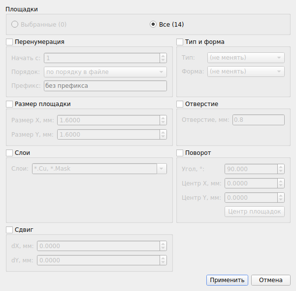
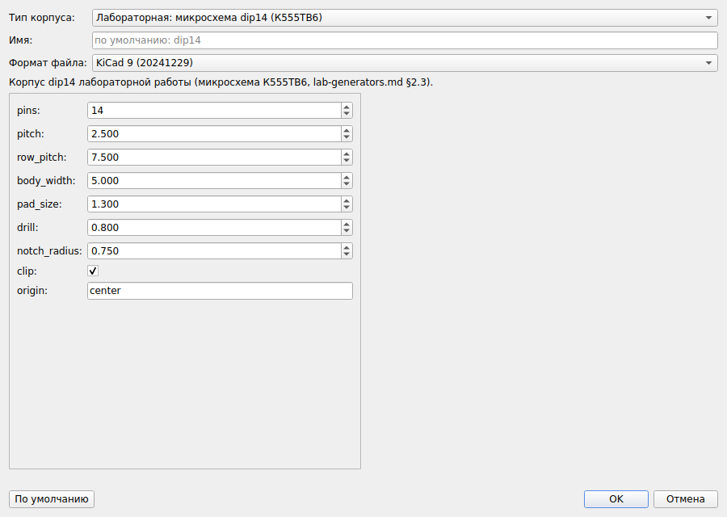
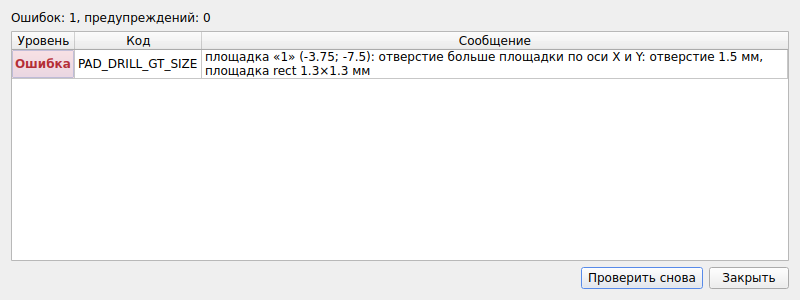

# kicadfp. Руководство пользователя

Программа «Библиотека и редактор файлов KiCad на языке Python» (рабочее название kicadfp),
этап 1: посадочные места (корпуса) компонентов. Версия программы 0.1.0.

Документ составлен по ГОСТ 19.505-79 («Руководство оператора») с учётом раздела 5 ТЗ.
Программный интерфейс (API) описан в руководстве программиста, устройство программы и форматы
файлов — в описании программы, порядок испытаний — в программе и методике испытаний.

Все примеры в документе выполнены на Linux в версии 0.1.0. Вывод команд вставлен без изменений,
только длинные листинги сокращены (пропуски отмечены `…`).

---

## 1 Назначение программы

### 1.1 Функциональное назначение

kicadfp работает с файлами посадочных мест САПР KiCad **без самой САПР**. Программа:

1. читает корпуса `.kicad_mod` в формате KiCad 5–9 (и 10-dev), библиотеки-каталоги `.pretty`
   и библиотеки старого формата `.mod` (PCBNEW-LibModule-V1, KiCad 4 и старше; только чтение);
2. показывает свойства корпуса, площадки, графику, тексты и 3D-модели, а также позволяет их
   изменять из командной строки, из графического интерфейса и из скриптов на Python;
3. создаёт типовые корпуса по параметрам: DIP, штыревые разъёмы, выводные резисторы,
   конденсаторы и диоды, транзисторы TO-92, а также корпуса лабораторной работы dip14, mlt, snp8;
4. сохраняет корпус **без потерь**. Узлы, которые программа не знает, сохраняются без
   изменений, а неизменённый файл, записанный KiCad 8 или новее, воспроизводится байт в байт;
5. проверяет корпус на формальную корректность (п. 7.2);
6. переводит старые библиотеки `.mod` в `.pretty` и приводит файлы к каноническому
   форматированию KiCad;
7. строит изображения корпуса в форматах SVG и PNG.

### 1.2 Эксплуатационное назначение

Программа нужна инженерам-конструкторам, студентам и преподавателям, которые готовят и массово
исправляют библиотеки корпусов. Типовые задачи:

- создать библиотеку корпусов для лабораторной работы за несколько команд;
- поменять размер площадок или отверстий во всех корпусах библиотеки одной командой;
- проверить библиотеку перед сдачей;
- перевести старую библиотеку `.mod` в современный формат.

### 1.3 Состав программы

| Часть | Как вызывается | Зависимости |
|---|---|---|
| Ядро (разбор, модель, запись, проверка, генераторы) | `import kicadfp` | только стандартная библиотека Python |
| Командная строка | `kicadfp КОМАНДА …` или `python -m kicadfp КОМАНДА …` | нет |
| Графический интерфейс | `kicadfp gui [ПУТЬ]` или `kicadfp-gui [ПУТЬ …]` | PySide6 ≥ 6.5 |
| Экспорт PNG (`kicadfp render … -o *.png`) | командная строка, меню GUI | PySide6 ≥ 6.5 |

---

## 2 Условия применения

### 2.1 Технические средства

- процессор x86-64 или ARM64, оперативная память от 2 ГБ;
- 200 МБ свободного места на диске (вместе с Python и Qt);
- для графического интерфейса — монитор с разрешением не ниже 1280 × 720;
- сетевое подключение нужно только для установки PySide6 из PyPI. Сама программа в сети
  не нуждается.

### 2.2 Программные средства

| Компонент | Требование |
|---|---|
| Операционная система | Windows 10/11, Linux (glibc 2.31 и новее), macOS 12 и новее |
| Python | 3.10 и новее (проверено на 3.11) |
| PySide6 | 6.5 и новее, только для GUI и PNG (проверено на 6.11) |
| KiCad | не требуется. Созданные файлы открываются в KiCad 8 и 9 |

Программа не использует модуль `pcbnew` из KiCad. Поэтому командная строка и ядро работают
и там, где KiCad не установлен.

### 2.3 Требования к пользователю

Пользователь должен уметь работать с KiCad и с командной строкой своей ОС. Для работы со
скриптами нужно знать Python на уровне написания скриптов.

### 2.4 Единицы и система координат

Все размеры задаются в миллиметрах, углы — в градусах. Система координат та же, что в KiCad:
ось X направлена вправо, ось Y — **вниз**, положительный угол означает поворот против часовой
стрелки на экране. Десятичный разделитель в командной строке — точка. В полях графического
интерфейса можно вводить и запятую.

---

## 3 Установка

### 3.1 Состав поставки

Программа поставляется как исходный код в репозитории Git: `pyproject.toml`, `README.md`,
`LICENSE`, пакет `kicadfp/`. Из него можно собрать колесо (wheel). Команды ниже выполняются из
корня репозитория.

### 3.2 Варианты установки (extras)

| Команда | Что устанавливается |
|---|---|
| `pip install .` | ядро, API и командная строка `kicadfp` (без сторонних пакетов) |
| `pip install ".[gui]"` | то же и PySide6 для графического интерфейса `kicadfp gui` / `kicadfp-gui` |
| `pip install ".[png]"` | то же и PySide6 для экспорта PNG (без GUI состав тот же, что `gui`) |
| `pip install ".[dev]"` | то же и pytest, pytest-cov, pytest-qt, PySide6 для запуска тестов |

Для разработки удобна установка в режиме редактирования: `pip install -e ".[dev]"`.

Колесо для передачи на другой компьютер собирается так:

```bash
pip wheel . --no-deps -w dist          # dist/kicadfp-0.1.0-py3-none-any.whl
pip install dist/kicadfp-0.1.0-py3-none-any.whl
```

Колесо универсальное (`py3-none-any`) и ставится на любой ОС.

### 3.3 Linux и macOS

```bash
cd kicadfp                      # корень репозитория
python3 -m venv .venv           # отдельное окружение (рекомендуется)
. .venv/bin/activate
pip install ".[gui]"
```

В Linux без графического сеанса (сервер, CI) Qt нужно запускать с платформой `offscreen`:
`export QT_QPA_PLATFORM=offscreen`. Это требуется для `render … -o *.png` и для тестов GUI.

### 3.4 Windows

```bat
cd kicadfp
py -3 -m venv .venv
.venv\Scripts\activate
pip install ".[gui]"
```

Вызов команд тот же: `kicadfp …`. Если каталог `Scripts` не попал в `PATH`, используйте
`python -m kicadfp …`. Вывод текста файла в stdout (например, `kicadfp gen dip > dip.kicad_mod`)
идёт байтами UTF-8 с переводами строк LF, как пишет KiCad. Запись в файл через `-o` даёт тот же
результат.

### 3.5 Проверка установки

```console
$ kicadfp --version
kicadfp 0.1.0
$ python -m kicadfp --version
kicadfp 0.1.0
```

Если PySide6 не установлен, ядро и командная строка работают, а команды, которым он нужен,
завершаются с кодом 2 и подсказкой (проверено в чистом окружении с установленным колесом):

```console
$ kicadfp gui
ошибка: для графического интерфейса нужен PySide6: установите его командой pip install kicadfp[gui]
$ kicadfp render dip14.kicad_mod -o dip14.png
ошибка: для экспорта PNG нужен PySide6: установите его командой pip install kicadfp[png]
```

### 3.6 Удаление

```bash
pip uninstall kicadfp
```

---

## 4 Работа с командной строкой

### 4.1 Общие сведения

#### 4.1.1 Синтаксис

```text
kicadfp [-h] [--version] КОМАНДА [ПАРАМЕТРЫ] PATH …
```

| Команда | Назначение | Изменяет файлы |
|---|---|---|
| `info` | сводка по корпусу или библиотеке | нет |
| `list` | имена корпусов библиотеки | нет |
| `pads` | таблица площадок | нет |
| `validate` | проверка корректности | нет |
| `set` | изменение свойства корпуса или его элементов | только с `-w` или `-o` |
| `gen` | создание типового корпуса генератором | только с `-o` |
| `fmt` | каноническое форматирование KiCad | только с `-w` или `-o` |
| `convert` | перевод библиотеки `.mod` в каталог `.pretty` | только с `-o` |
| `render` | изображение SVG/PNG | только с `-o` |
| `gui` | запуск графического интерфейса | — |

Справка по программе: `kicadfp -h`, справка по команде: `kicadfp КОМАНДА -h`, параметры
генератора: `kicadfp gen ВИД --list`.

Длинные параметры нельзя сокращать: `--pad` вместо `--pad-size` будет ошибкой.

#### 4.1.2 Аргумент PATH

- **файл `.kicad_mod`** — команда обрабатывает один корпус;
- **каталог `.pretty`** — команда обрабатывает каждый корпус библиотеки. Параметр `--fp ИМЯ`
  (у `info`, `validate`, `set`, `pads`, `fmt`, `render`) ограничивает её одним корпусом;
- **библиотека `.mod`** старого формата — только чтение (`info`, `list`, `validate`, `pads`,
  `render`). Корпуса показываются в том виде, в каком их даёт перевод в современный формат.

#### 4.1.3 Вывод и запись

- Результат выводится в stdout, сообщения и предупреждения — в stderr. Поэтому `>` в файл
  перенаправляет только результат.
- **Без `-w/--write` или `-o` файлы не изменяются** (ТЗ 4.1.7). Команда, которая могла бы
  записать файл, сообщает об этом строкой `файл не изменён (для записи используйте --write или -o ФАЙЛ)`.
- Запись атомарная: сначала создаётся временный файл в том же каталоге, затем он
  переименовывается. Если запись оборвётся, исходный файл останется целым.
- Кодировка — UTF-8, перевод строки — LF.

#### 4.1.4 Коды возврата

| Код | Значение |
|---|---|
| `0` | успешно. У `validate` — нет ошибок (с `--strict` нет и предупреждений); у `fmt --check` — все файлы уже в каноническом виде |
| `1` | найдены замечания или различия: `validate` нашла ошибки (с `--strict` — и предупреждения); `fmt --check` нашла файлы, требующие форматирования; `set`/`gen --strict` не записали результат из-за ошибок проверки |
| `2` | ошибка входных данных: синтаксическая ошибка файла, файл не найден, неверные аргументы или значение, селектор не нашёл элементов, нет PySide6. Внутренняя ошибка программы тоже даёт код 2 |

Код возврата удобно использовать в скриптах и CI:

```bash
kicadfp validate mylib.pretty --strict && echo "библиотека чистая"
```

#### 4.1.5 Исходные данные примеров

Примеры раздела 4 выполнены в пустом каталоге, куда скопированы файлы из репозитория:

```bash
cp tests/fixtures/kicad8/Package_DIP.pretty/DIP-14_W7.62mm.kicad_mod .
cp tests/fixtures/kicad8/Package_DIP.pretty/DIP-14_W7.62mm.kicad_mod dip14.kicad_mod
cp tests/fixtures/legacy_mod/My_lib.mod .
```

`DIP-14_W7.62mm.kicad_mod` — корпус из стандартной библиотеки KiCad 8. `My_lib.mod` —
библиотека старого формата с корпусами dip14, mlt и snp8, созданными вручную в лабораторной
работе.

### 4.2 Команда info — сводка по корпусу

**Синтаксис:** `kicadfp info [--fp ИМЯ] [--json] PATH`

| Параметр | Назначение |
|---|---|
| `--fp ИМЯ` | для библиотеки — только корпус ИМЯ |
| `--json` | вывод в формате JSON |

Команда выводит имя, файл, версию формата (и версию KiCad, которой она соответствует),
генератор, слой, описание, ключевые слова, атрибуты, число площадок по типам, список слоёв,
габариты, число графических элементов, текстов и 3D-моделей. Если в файле есть неизвестные
узлы, выводится ещё строка `Неизвестные узлы:`.

```console
$ kicadfp info DIP-14_W7.62mm.kicad_mod
Корпус:         DIP-14_W7.62mm
Файл:           DIP-14_W7.62mm.kicad_mod
Формат:         20240108 (KiCad 8)
Генератор:      pcbnew 8.0
Слой:           F.Cu
Описание:       14-lead though-hole mounted DIP package, row spacing 7.62 mm (300 mils)
Ключевые слова: THT DIP DIL PDIP 2.54mm 7.62mm 300mil
Атрибуты:       through_hole
Площадки:       14 (thru_hole: 14)
Слои:           *.Cu, F.SilkS, *.Mask, F.CrtYd, F.Fab
Габариты:       9.8 x 18.35 мм (X: -1.1 .. 8.7, Y: -1.55 .. 16.8)
Графика:        15 (line: 14, arc: 1)
Тексты:         6 (reference: 1, value: 1, user: 4)
3D-модели:      1 (${KICAD8_3DMODEL_DIR}/Package_DIP.3dshapes/DIP-14_W7.62mm.wrl)
```

Для библиотеки сначала выводится заголовок, затем сводка по каждому корпусу:

```console
$ kicadfp info tests/fixtures/kicad9/Package_DIP.pretty
Библиотека: Package_DIP (/home/user/kicadfp/tests/fixtures/kicad9/Package_DIP.pretty), корпусов: 28

Корпус:         CERDIP-14_W7.62mm_SideBrazed
…
```

Фрагмент вывода с `--json`:

```console
$ kicadfp info DIP-14_W7.62mm.kicad_mod --json
{
  "name": "DIP-14_W7.62mm",
  "path": "DIP-14_W7.62mm.kicad_mod",
  "root": "footprint",
  "version": 20240108,
  "kicad": "KiCad 8",
  "generator": "pcbnew",
  "generator_version": "8.0",
  "layer": "F.Cu",
  …
  "pads": {
    "total": 14,
    "by_type": {
      "thru_hole": 14
    }
  },
  …
  "bbox": {
    "x1": -1.1,
    "y1": -1.55,
    "x2": 8.7,
    "y2": 16.8,
    "width": 9.8,
    "height": 18.35
  },
  …
  "zones": 0,
  "groups": 0,
  "unknown": []
}
```

Старая библиотека `.mod` читается напрямую:

```console
$ kicadfp info My_lib.mod
Библиотека: My_lib (My_lib.mod), корпусов: 3

Корпус:         dip14
Файл:           My_lib.mod
Формат:         старый формат .mod (показан после преобразования в 20241229)
…
```

### 4.3 Команда list — перечень корпусов библиотеки

**Синтаксис:** `kicadfp list [--json] LIB`

`LIB` — каталог `.pretty`, библиотека `.mod` или файл `.kicad_mod`. Для каталога имена
выводятся по алфавиту (это имена файлов без расширения).

```console
$ kicadfp list My_lib.mod
dip14
mlt
snp8
$ kicadfp list tests/fixtures/kicad9/Package_DIP.pretty | head -3
CERDIP-14_W7.62mm_SideBrazed
CERDIP-18_W7.62mm_SideBrazed_LongPads_Socket
CERDIP-24_W7.62mm_SideBrazed
```

### 4.4 Команда pads — таблица площадок

**Синтаксис:** `kicadfp pads [--fp ИМЯ] [--json] PATH`

Столбцы: номер, тип, форма, X, Y, угол, размер X, размер Y, отверстие, слои. Площадки
выводятся в порядке файла. Пустой номер (неметаллизированное монтажное отверстие)
показывается как `""`, отсутствие отверстия — как `-`, овальное отверстие — как `ШxВ`.

```console
$ kicadfp pads DIP-14_W7.62mm.kicad_mod
№   Тип        Форма  X     Y      Угол  Размер X  Размер Y  Отверстие  Слои
1   thru_hole  rect   0     0      0     1.6       1.6       0.8        *.Cu,*.Mask
2   thru_hole  oval   0     2.54   0     1.6       1.6       0.8        *.Cu,*.Mask
…
13  thru_hole  oval   7.62  2.54   0     1.6       1.6       0.8        *.Cu,*.Mask
14  thru_hole  oval   7.62  0      0     1.6       1.6       0.8        *.Cu,*.Mask
```

С `--json` для каждой площадки выводится объект с полями `number`, `type`, `shape`, `x`, `y`,
`angle`, `size_x`, `size_y`, `drill` (`diameter`, `width`, `oval`, `offset_x`, `offset_y`),
`layers`, `roundrect_rratio`.

### 4.5 Команда validate — проверка

**Синтаксис:** `kicadfp validate [--fp ИМЯ] [--strict] [--json] PATH`

| Параметр | Назначение |
|---|---|
| `--strict` | код возврата 1 не только при ошибках, но и при предупреждениях |
| `--json` | отчёт в формате JSON (с номером строки файла у каждого замечания) |

Каждое замечание выводится строкой `УРОВЕНЬ КОД: сообщение`. Уровень — `ERROR` (ошибка)
или `WARNING` (предупреждение). Для библиотеки перед строкой стоит имя корпуса. Перечень
кодов и действия пользователя приведены в п. 7.2.

```console
$ kicadfp validate DIP-14_W7.62mm.kicad_mod
замечаний нет
$ echo $?
0
$ kicadfp validate My_lib.mod
dip14: WARNING COURTYARD_MISSING: корпус «dip14»: нет области размещения (графики на F.CrtYd/B.CrtYd)
mlt: WARNING COURTYARD_MISSING: корпус «mlt»: нет области размещения (графики на F.CrtYd/B.CrtYd)
snp8: WARNING COURTYARD_MISSING: корпус «snp8»: нет области размещения (графики на F.CrtYd/B.CrtYd)
проверено корпусов: 3; ошибок: 0, предупреждений: 3
$ echo $?
0
```

Пример с ошибкой (файл `bad.kicad_mod` получен в п. 4.6.4):

```console
$ kicadfp validate bad.kicad_mod
ERROR PAD_DRILL_GT_SIZE: площадка «1» (0; 0): отверстие больше площадки по оси X и Y: отверстие 1.5 мм, площадка rect 1.3×1.3 мм
ошибок: 1, предупреждений: 0
$ echo $?
1
$ kicadfp validate bad.kicad_mod --json
{
  "name": "DIP-14_W7.62mm",
  "path": "bad.kicad_mod",
  "issues": [
    {
      "level": "error",
      "code": "PAD_DRILL_GT_SIZE",
      "message": "площадка «1» (0; 0): отверстие больше площадки по оси X и Y: отверстие 1.5 мм, площадка rect 1.3×1.3 мм",
      "line": 229
    }
  ],
  "errors": 1,
  "warnings": 0
}
```

### 4.6 Команда set — изменение свойства

**Синтаксис:** `kicadfp set [--fp ИМЯ] [-w | -o OUT] [--strict] PATH SELECTOR VALUE`

| Параметр | Назначение |
|---|---|
| `-w`, `--write` | записать изменения в исходный файл (для библиотеки — во все изменённые файлы) |
| `-o OUT`, `--output OUT` | записать результат в файл OUT (для библиотеки — в каталог OUT) |
| `--strict` | не записывать ничего, если после изменения проверка находит ошибки (код 1) |
| `--fp ИМЯ` | для библиотеки — изменять только корпус ИМЯ |

`-w` и `-o` взаимоисключающие. Если ни один не указан, команда выполняет пробный прогон:

- для файла текст результата выводится в stdout, а список изменений — в stderr;
- для каталога список изменений выводится в stdout.

#### 4.6.1 Селекторы

| Селектор | Что выбирает |
|---|---|
| `footprint.ATTR` | свойство корпуса: `descr`, `name`, `tags`, `layer`, `attrs` (`"smd,exclude_from_bom"`), `clearance`, `solder_mask_margin`, `solder_paste_margin`, `solder_paste_ratio`, `zone_connect` … |
| `pad[N].ATTR` | площадки с номером `N` (`pad[1]`, `pad[A1]`; `pad[]` — пустой номер). Если площадок с таким номером несколько, меняются все: в KiCad это один вывод |
| `pad[*].ATTR` | все площадки, **включая монтажные отверстия** `np_thru_hole` |
| `pad[#i].ATTR` | площадка с индексом `i` в порядке файла (с 0; `#-1` — последняя) |
| `text[reference].ATTR`, `text[value].ATTR` | тексты Reference и Value |
| `text[user].ATTR`, `text[user:N].ATTR` | все пользовательские тексты; `N`-й из них (с 0) |
| `text[ИМЯ].ATTR` | поле KiCad 8+ по имени, например `text[Datasheet]` |
| `text[*]`, `text[#i]` | все тексты; текст по индексу |
| `graphic[i].ATTR` | графический элемент по индексу (с 0) |
| `graphic[*]`, `graphic[СЛОЙ]`, `graphic[ВИД]` | вся графика; графика на слое (`graphic[F.SilkS]`, `graphic[*.Fab]`); графика вида `line`, `rect`, `circle`, `arc`, `poly`, `curve` |
| `model[i].ATTR`, `model[*].ATTR` | 3D-модель по индексу; все модели |
| `property[КЛЮЧ]` | свойство корпуса `(property "КЛЮЧ" …)`; значение `none` удаляет его |

Основные атрибуты площадки: `number`, `type` (`thru_hole`, `smd`, `connect`, `np_thru_hole`),
`shape` (`circle`, `rect`, `oval`, `trapezoid`, `roundrect`, `custom`), `x`, `y`, `angle`,
`size`, `size_x`, `size_y`, `drill` (и вложенные `drill.diameter`, `drill.offset_x` …), `layers`,
`roundrect_rratio`, `chamfer_ratio`, `chamfer`, `net`, `pinfunction`, `pintype`, `clearance`,
`solder_mask_margin`, `solder_paste_margin`, `solder_paste_ratio`, `zone_connect`. Полный
список выводится в сообщении об ошибке, если указать неизвестный атрибут (п. 7.1).

Атрибуты графики: `layer`, `width`, `stroke_type`, `fill`, `start`, `end`, `center` и другие
координаты по виду элемента. Атрибуты текста: `text`, `x`, `y`, `angle`, `layer`, `hide`,
`font_size_x`, `font_size_y`, `thickness`, `bold`, `italic`, `justify`, `mirror`.

#### 4.6.2 Запись значений

| Тип атрибута | Как записывать VALUE |
|---|---|
| число | `0.8`, `-1.5` (разделитель — точка) |
| логическое | `yes`/`no`, `true`/`false`, `1`/`0`, `да`/`нет` |
| строка | как есть (в кавычках оболочки, если есть пробелы) |
| список (слои, атрибуты) | через запятую или пробел: `"F.Cu,F.Mask,F.Paste"`; можно JSON-массивом `'["F.Cu","F.Mask"]'` |
| пара чисел | `"1.2,0.8"`, `"1.2 0.8"` или `1.2x0.8` |
| список точек | `"0,0;1,0;1,1"` |
| удалить необязательный токен | `none` (или `null`) |

Особые случаи:

- `pad[N].size 1.3` задаёт обе стороны площадки;
- `drill 0.8` задаёт круглое отверстие, `drill 1.2x0.8` — овальное, `drill none` удаляет
  отверстие.

Отрицательные числа передаются как есть (`pad[1].x -1.5`). Если значение начинается с `-` и
не является числом, его передают после `--`, а параметры `-o`/`-w` ставят **перед** `--`:
`kicadfp set f.kicad_mod "footprint.descr" -o out.kicad_mod -- "-текст"`.

Селекторы со скобками берите в кавычки, иначе оболочка может раскрыть `[*]` как шаблон
имён файлов.

#### 4.6.3 Примеры

Пробный прогон (файл не меняется):

```console
$ kicadfp set dip14.kicad_mod footprint.descr "DIP-14" > out.txt
footprint.descr: "14-lead though-hole mounted DIP package, row spacing 7.62 mm (300 mils)" -> "DIP-14"
файл не изменён (для записи используйте --write или -o ФАЙЛ)
```

Запись в новый файл. Отличается одна строка:

```console
$ kicadfp set dip14.kicad_mod footprint.descr "DIP-14" -o dip14_new.kicad_mod
footprint.descr: "14-lead though-hole mounted DIP package, row spacing 7.62 mm (300 mils)" -> "DIP-14"
записан: dip14_new.kicad_mod
$ diff dip14.kicad_mod dip14_new.kicad_mod
6c6
< 	(descr "14-lead though-hole mounted DIP package, row spacing 7.62 mm (300 mils)")
---
> 	(descr "DIP-14")
```

Изменение на месте. Если значение уже такое, файл не перезаписывается:

```console
$ kicadfp set dip14.kicad_mod "pad[*].drill" 0.8 --write
pad[1].drill: 0.8 (без изменений)
…
pad[14].drill: 0.8 (без изменений)
без изменений (значения уже такие): dip14.kicad_mod
$ kicadfp set dip14.kicad_mod "pad[*].size" 1.3 --write
pad[1].size: (1.6, 1.6) -> (1.3, 1.3)
…
pad[14].size: (1.6, 1.6) -> (1.3, 1.3)
записан: dip14.kicad_mod
```

Другие селекторы:

```console
$ kicadfp set br8_timer.pretty "text[reference].layer" F.Fab --fp mlt -o mlt2.kicad_mod
text[reference].layer: "F.SilkS" -> "F.Fab"
записан: mlt2.kicad_mod
$ kicadfp set br8_timer.pretty "property[Datasheet]" "https://example.org/k555tv6.pdf" --fp dip14 -w
property[Datasheet]: нет -> "https://example.org/k555tv6.pdf"
записан: br8_timer.pretty/dip14.kicad_mod
```

#### 4.6.4 Проверка после изменения, режим --strict

`set` сравнивает замечания проверки до и после изменения и выводит в stderr новые. По
умолчанию файл всё равно записывается, как требует ТЗ 4.1.5:

```console
$ kicadfp set dip14.kicad_mod "pad[1].drill" 1.5 -o bad.kicad_mod
pad[1].drill: 0.8 -> 1.5
предупреждение: после изменения: ERROR PAD_DRILL_GT_SIZE: площадка «1» (0; 0): отверстие больше площадки по оси X и Y: отверстие 1.5 мм, площадка rect 1.3×1.3 мм
записан: bad.kicad_mod
```

С `--strict` при ошибках не записывается ничего, код возврата 1:

```console
$ kicadfp set dip14.kicad_mod "pad[1].drill" 1.5 -o bad2.kicad_mod --strict
pad[1].drill: 0.8 -> 1.5
предупреждение: после изменения: ERROR PAD_DRILL_GT_SIZE: …
ERROR PAD_DRILL_GT_SIZE: площадка «1» (0; 0): отверстие больше площадки по оси X и Y: отверстие 1.5 мм, площадка rect 1.3×1.3 мм
строгая проверка: есть ошибки — ничего не записано
$ echo $?
1
```

#### 4.6.5 Групповое изменение библиотеки

Для каталога `.pretty` команда применяется ко всем корпусам. Корпуса, в которых селектор
ничего не нашёл, пропускаются. Если хотя бы один файл не прочитан или изменение не удалось,
не записывается ничего (код 2).

```console
$ kicadfp set br8_timer.pretty "pad[*].drill" 0.9 -o br8_new.pretty
…
snp8: pad[7].drill: 0.8 -> 0.9
snp8: pad[8].drill: 0.8 -> 0.9
записано файлов: 3 в br8_new.pretty (изменено корпусов: 3)
```

С `-o КАТАЛОГ` в новый каталог записываются все корпуса библиотеки, неизменённые — копией
файла.

> **Внимание.** `pad[*]` выбирает и неметаллизированные монтажные отверстия. В примере выше у
> двух монтажных отверстий snp8 диаметр тоже стал 0.9 вместо 3:
> `pad[#0].drill: 3 -> 0.9`. Чтобы изменить только выводы, выбирайте площадки по номеру
> (`pad[1]` … `pad[8]`) или по индексу, либо используйте групповые операции GUI (п. 5.10)
> с выделенными площадками.

### 4.7 Команда gen — создание типового корпуса

**Синтаксис:**

```text
kicadfp gen [--list]
kicadfp gen ВИД --list
kicadfp gen ВИД [--ПАРАМЕТР ЗНАЧЕНИЕ …] [--params FILE.json] [--name ИМЯ]
            [-o OUT] [--strict] [--kicad {6,7,8,9}]
```

| Параметр | Назначение |
|---|---|
| `ВИД` | генератор (таблица 4.1) |
| `--ПАРАМЕТР ЗНАЧЕНИЕ` | параметр генератора. Имя пишется через дефис (`--row-pitch`), логическое значение можно без аргумента (`--first-square`) или с `yes/no` |
| `--params FILE.json` | параметры из JSON-файла (имена — с подчёркиванием, как в Python). Командная строка важнее файла |
| `--name ИМЯ` | имя корпуса |
| `-o OUT` | файл `.kicad_mod` или каталог (существующий, с `/` в конце или с расширением `.pretty`: в нём создаётся `<имя>.kicad_mod`). Недостающие каталоги создаются. Без `-o` текст корпуса выводится в stdout |
| `--strict` | не записывать, если проверка находит ошибки (код 1) |
| `--kicad N` | формат файла для KiCad N (по умолчанию 9). **KiCad 8 не открывает файлы формата KiCad 9**, поэтому для KiCad 8 указывайте `--kicad 8` |
| `--list` | без ВИДа — список генераторов, с ВИДом — таблица его параметров |

Имя корпуса выбирается так: значение `--name`; если его нет, а `-o` — файл, то имя файла
(KiCad отождествляет их); иначе имя по умолчанию генератора.

*Таблица 4.1 — Генераторы*

| ВИД | Синонимы | Корпус |
|---|---|---|
| `dip` | — | DIP: два ряда, нумерация «U», начало координат — площадка 1 |
| `pin_header` | — | прямой штыревой разъём, 1…N рядов, монтажные отверстия (только через JSON) |
| `resistor` | — | выводной резистор, горизонтальный монтаж |
| `capacitor_radial` | — | радиальный конденсатор (дисковый или полярный) |
| `capacitor_axial` | — | осевой конденсатор |
| `diode` | — | выводной диод с полосой катода |
| `transistor` | `transistor_inline`, `to92` | TO-92 с выводами в линию |
| `lab_dip14` | `dip14` | корпус dip14 лабораторной работы (К555ТВ6) |
| `lab_mlt` | `mlt` | резистор МЛТ лабораторной работы |
| `lab_snp8` | `snp8` | разъём СНП на 8 контактов лабораторной работы |

Все генераторы строят шелкографию (F.SilkS), сборочный контур (F.Fab) и область размещения
(F.CrtYd). Параметры генератора:

```console
$ kicadfp gen lab_dip14 --list
Параметры генератора lab_dip14 (kicadfp gen lab_dip14 --ПАРАМЕТР ЗНАЧЕНИЕ):
  параметр        тип    по умолчанию  описание
  --name          str    dip14         имя корпуса.
  --pins          int    14            число выводов (чётное).
  --pitch         float  2.5           шаг выводов в ряду, мм.
  --row-pitch     float  7.5           расстояние между рядами, мм.
  --body-width    float  5             ширина контура корпуса, мм.
  --pad-size      float  1.3           диаметр (сторона) площадок, мм.
  --drill         float  0.8           диаметр отверстий, мм.
  --notch-radius  float  0.75          радиус выемки-ключа, мм.
  --clip          bool   yes           обрезать шелкографию у площадок (зазор до меди не меньше 0.2 мм).
  --origin        str    center        начало координат: center — центр блока площадок, pin1 — площадка 1.
$ kicadfp gen dip --list
Параметры генератора dip (kicadfp gen dip --ПАРАМЕТР ЗНАЧЕНИЕ):
  параметр        тип                          по умолчанию  описание
  --pins          int                          14            число выводов (чётное, не меньше 2).
  --pitch         float                        2.54          шаг выводов в ряду, мм.
  --row-pitch     float                        7.62          расстояние между рядами (по центрам площадок), мм.
  --pad-size      float | tuple[float, float]  1.6,1.6       размер площадки, мм: число или пара (ширина, высота).
  --drill         float                        0.8           диаметр отверстия, мм.
  --body-width    float | None                 вычисляется   ширина корпуса, мм (по умолчанию — по таблице KiCad, иначе row_pitch − 1.27).
  --first-square  bool                         yes           площадка 1 прямоугольная (rect).
  --pad-shape     str                          oval          форма остальных площадок (oval, circle, rect).
  --name          str | None                   вычисляется   имя корпуса (по умолчанию DIP-{pins}_W{row_pitch}mm[_P{pitch}mm]).
  --body-length   float | None                 вычисляется   длина корпуса, мм (по умолчанию — (pins/2 − 1)·pitch + pitch, т.е. выступ pitch/2 за крайние выводы).
```

Примеры:

```console
$ kicadfp gen dip --pins 14 --pitch 2.5 --row-pitch 7.5 -o br8_timer.pretty/dip14.kicad_mod
записан: br8_timer.pretty/dip14.kicad_mod (корпус dip14, площадок: 14)
$ kicadfp gen mlt -o br8_timer.pretty/
записан: br8_timer.pretty/mlt.kicad_mod (корпус mlt, площадок: 2)
$ kicadfp gen dip --pins 8 --kicad 8 -o k8.kicad_mod
записан: k8.kicad_mod (корпус k8, площадок: 8)
$ kicadfp gen resistor --pitch 10 | head -3
(footprint "R_Axial_L6.3mm_D2.5mm_P10.00mm_Horizontal"
	(version 20241229)
	(generator "kicadfp")
```

Параметры из JSON: разъём из приложения В.2 ТЗ с монтажными отверстиями:

```console
$ cat snp8.json
{"rows": 2, "cols": 4, "pitch": 2.5, "row_pitch": 5.0,
 "pad_size": 1.3, "drill": 0.8, "first_square": true,
 "mounting_holes": [[11.25, -5.0, 3.0], [11.25, 15.0, 3.0]]}
$ kicadfp gen pin_header --params snp8.json --name snp8 -o hdr.pretty
записан: hdr.pretty/snp8.kicad_mod (корпус snp8, площадок: 10)
```

Недопустимые параметры дают код 2 и ничего не записывают:

```console
$ kicadfp gen dip --pins 13
ошибка: gen dip: pins: ожидается чётное число не меньше 2, получено 13
$ kicadfp gen dip --pins 14 --drill 2 -o s.kicad_mod
ошибка: gen dip: отверстие 2 мм больше площадки 1.6×1.6 мм
```

> Повторный `gen … -o` с тем же путём перезаписывает файл без вопроса.

### 4.8 Команда fmt — каноническое форматирование

**Синтаксис:** `kicadfp fmt [--fp ИМЯ] [--check | -w | -o OUT] [--style СТИЛЬ] PATH`

Команда переписывает файл в форматировании, которое использует сам KiCad: отступы, перенос
строк, запись чисел. **Содержание при этом не меняется**: перед записью программа проверяет,
что дерево S-выражений осталось тем же.

| Параметр | Назначение |
|---|---|
| `--check` | только проверить. Код 1, если есть файлы не в каноническом виде |
| `-w`, `--write` | переписать файлы на месте |
| `-o OUT` | записать в файл OUT (для библиотеки — в каталог) |
| `--style` | `auto` (по умолчанию — по версии файла), `kicad8` (KiCad 8/9/10), `kicad7`, `kicad6`, `kicad5` |

Без ключей для файла текст выводится в stdout, для каталога — список файлов, которые
изменились бы.

```console
$ sed 's/^\t/  /' DIP-14_W7.62mm.kicad_mod > ugly.kicad_mod     # испортить отступы
$ kicadfp fmt ugly.kicad_mod --check
требуется форматирование: ugly.kicad_mod (первое отличие в строке 2)
требуют форматирования файлов: 1 из 1
$ echo $?
1
$ kicadfp fmt ugly.kicad_mod --write
переформатирован: ugly.kicad_mod
переформатировано файлов: 1 из 1
$ cmp ugly.kicad_mod DIP-14_W7.62mm.kicad_mod && echo identical
identical
$ kicadfp fmt br8_timer.pretty --check
все файлы в каноническом форматировании (проверено: 3)
```

### 4.9 Команда convert — перевод старой библиотеки .mod

**Синтаксис:** `kicadfp convert [-o OUT.pretty] [--compat {kicad9,fixed}] [--kicad {6,7,8,9}] IN.mod`

| Параметр | Назначение |
|---|---|
| `-o OUT.pretty` | каталог результата. Без `-o` файлы не пишутся, выводится список корпусов |
| `--compat kicad9` | результат как у конвертера KiCad 9 (по умолчанию) |
| `--compat fixed` | физически корректная конвертация (например, смещение 3D-модели в мм) |
| `--kicad N` | формат результата (по умолчанию 9; для KiCad 8 — `--kicad 8`) |

Каждый модуль сохраняется отдельным файлом `<имя>.kicad_mod`, децимилы переводятся в
миллиметры (1 децимил = 0.00254 мм).

```console
$ kicadfp convert My_lib.mod
dip14 (площадок: 14)
mlt (площадок: 2)
snp8 (площадок: 10)
файлы не записаны: укажите каталог результата, например kicadfp convert My_lib.mod -o My_lib.pretty
$ kicadfp convert My_lib.mod -o old_lib.pretty
записан: old_lib.pretty/dip14.kicad_mod
записан: old_lib.pretty/mlt.kicad_mod
записан: old_lib.pretty/snp8.kicad_mod
преобразовано корпусов: 3 -> old_lib.pretty
```

Существующие файлы с теми же именами в каталоге результата перезаписываются.

### 4.10 Команда render — изображение корпуса

**Синтаксис:** `kicadfp render [--fp ИМЯ] [-o OUT] [--layers СЛОИ] [--scale PX] [--width PX] [--grid ММ] [--no-grid] [--no-background] [--margin ММ] [--pad-numbers] [--show-hidden] [--format {svg,png}] PATH`

| Параметр | По умолчанию | Назначение |
|---|---|---|
| `-o OUT` | SVG в stdout | файл `.svg` или `.png`; для библиотеки — каталог (файлы `<имя>.svg`/`.png`) |
| `--format` | `svg` | формат файлов при выводе в каталог |
| `--layers` | все | только эти слои через запятую: `F.Cu,F.SilkS,*.Fab` |
| `--scale` | 10 | масштаб SVG, пикселей на мм |
| `--width` | 800 | ширина PNG, пикселей |
| `--grid` / `--no-grid` | 1 мм | шаг сетки / без сетки |
| `--no-background` | — | прозрачный фон |
| `--margin` | 2 | поле вокруг корпуса, мм |
| `--pad-numbers` | — | подписать номера площадок |
| `--show-hidden` | — | рисовать скрытые тексты |

Слои рисуются цветами KiCad. PNG требует PySide6 (п. 3.5).

```console
$ kicadfp render br8_timer.pretty --fp dip14 -o dip14.svg
записан: dip14.svg
$ kicadfp render br8_timer.pretty/dip14.kicad_mod -o dip14.png --width 600 --pad-numbers
записан: dip14.png
$ kicadfp render br8_timer.pretty -o img --format png
записан: img/dip14.png
записан: img/mlt.png
записан: img/snp8.png
```

### 4.11 Команда gui — графический интерфейс

**Синтаксис:** `kicadfp gui [PATH]` (то же, что `kicadfp-gui [PATH …]`)

`PATH` — файл корпуса или каталог `.pretty`, который надо открыть сразу. Работа в окне описана
в разделе 5.

### 4.12 Переменные окружения

| Переменная | Назначение |
|---|---|
| `KICADFP_DEBUG=1` | при внутренней ошибке выводить полную трассировку Python |
| `KICADFP_THEME=light\|dark\|auto` | тема оформления GUI |
| `KICADFP_SETTINGS=ПУТЬ` | файл настроек окна (INI) вместо стандартного места |
| `QT_QPA_PLATFORM=offscreen` | запуск Qt без дисплея (PNG на сервере, тесты) |

---

## 5 Работа с графическим интерфейсом

### 5.1 Запуск

```bash
kicadfp gui                                   # пустое окно
kicadfp gui br8_timer.pretty                  # открыть библиотеку в дереве
kicadfp-gui DIP-14_W7.62mm.kicad_mod lib.pretty
```

`kicadfp-gui` принимает несколько путей, а также ключи Qt (`-style fusion` и т. п.).
Каталоги открываются в дереве библиотек, первый файл — в редакторе. Файлы и каталоги можно
также перетащить в окно мышью.

### 5.2 Главное окно


*Рисунок 5.1 — Главное окно: дерево библиотек и слои (слева), поле просмотра (в центре),
свойства корпуса (справа), таблицы площадок и графики (снизу)*

| Область | Назначение |
|---|---|
| Меню «Файл» | Создать корпус (Ctrl+N), Открыть файл (Ctrl+O), Открыть библиотеку (Ctrl+Shift+O), Недавние файлы, Сохранить (Ctrl+S), Сохранить как (Ctrl+Shift+S), Экспорт SVG, Экспорт PNG, Выход (Ctrl+Q) |
| Меню «Правка» | Отменить (Ctrl+Z), Повторить (Ctrl+Shift+Z, Ctrl+Y), Удалить (Del), Свойства элемента (Enter на поле просмотра), Групповые операции над площадками, Добавить площадку / линию / прямоугольник / окружность / текст |
| Меню «Корпус» | Проверить (F7), Создать типовой корпус (Ctrl+G), Сдвинуть, Повернуть, Отразить, Перенумеровать площадки, Свойства корпуса |
| Меню «Вид» | Вписать (F), Увеличить (Ctrl++), Уменьшить (Ctrl+−), Сетка (1.25 / 1 / 0.5 / 0.25 / 0.1 мм, показ сетки), Привязка к сетке, Показывать скрытые тексты, Показать все слои, Панели |
| Панель инструментов | Создать, Открыть, Сохранить; Отменить, Повторить; добавить площадку, линию, прямоугольник, окружность, текст, удалить; Проверить, Создать типовой корпус; Вписать, масштаб |
| «Библиотеки» | дерево открытых библиотек `.pretty` и отдельных файлов (п. 5.3) |
| «Слои» | флажки видимости слоёв с цветами KiCad; «Показать все» / «Скрыть все». Кроме слоёв есть псевдослои «Отверстия» и «Номера площадок» |
| Поле просмотра | корпус в цветах KiCad, сетка, выбор и перетаскивание элементов (п. 5.8) |
| «Свойства корпуса» | имя, слой, описание, ключевые слова, атрибуты, зазоры, подключение к зонам (п. 5.5) |
| «Площадки», «Графика и тексты» | таблицы с редактированием ячеек (пп. 5.6, 5.7) |
| Строка состояния | координаты курсора в мм, шаг сетки, имя файла, признак изменения |

Заголовок окна — «kicadfp — имя», звёздочка в нём означает несохранённые изменения. Панели
можно перемещать, закрывать и возвращать через «Вид → Панели». Расположение панелей, сетка,
видимость слоёв, недавние файлы и открытые библиотеки запоминаются между запусками.

### 5.3 Открытие библиотек и корпусов

- **Файл → Открыть библиотеку…** (Ctrl+Shift+O): выберите каталог `.pretty`. Он появится в
  дереве «Библиотеки», корпуса перечислены по алфавиту.
- Двойной щелчок или Enter на корпусе в дереве открывает его в редакторе.
- **Файл → Открыть файл…** (Ctrl+O): файл `.kicad_mod` (KiCad 5–10) или `.mod`/`.emp`, в
  котором **один** корпус. Многокорпусную библиотеку `.mod` сначала переведите в `.pretty`
  командой `kicadfp convert` (п. 4.9). Корпус из `.mod` открывается как новый несохранённый.
- Одновременно редактируется один корпус. Если текущий корпус изменён, при открытии другого
  программа спросит: «Сохранить / Не сохранять / Отмена».

Контекстное меню дерева (правая кнопка):

| Пункт | Действие |
|---|---|
| Открыть | открыть корпус в редакторе |
| Переименовать… | переименовать файл и корпус (имя внутри файла тоже меняется) |
| Удалить… | удалить файл корпуса после подтверждения (клавиша Del в дереве делает то же) |
| Копировать в библиотеку… | выбрать одну из открытых библиотек и новое имя. Исходный корпус не изменяется |
| Обновить | перечитать каталог |
| Закрыть библиотеку/файл | убрать из дерева (файлы не удаляются) |

### 5.4 Создание нового корпуса

- **Файл → Создать корпус…** (Ctrl+N): введите имя, будет создан пустой корпус формата KiCad 9.
- **Корпус → Создать типовой корпус…** (Ctrl+G): см. п. 5.11.

Новый корпус не связан с файлом. Первое «Сохранить» открывает диалог «Сохранить как».

### 5.5 Свойства корпуса

На панели «Свойства корпуса» редактируются:

- имя, слой (F.Cu/B.Cu), описание, ключевые слова;
- атрибуты (флажки smd, through_hole, board_only, exclude_from_pos_files, exclude_from_bom,
  allow_missing_courtyard, dnp);
- зазор, отступы маски и пасты, коэффициент пасты (пустое поле — «не задано»);
- подключение к зонам.

Версия формата и UUID показываются только для чтения. Текстовое поле применяется по Enter или
при уходе из поля, флажки и списки — сразу. Недопустимое значение (например, буквы в числовом
поле) не принимается: поле возвращается к прежнему значению.

### 5.6 Таблица площадок

Столбцы: «№», «Тип», «Форма», «X», «Y», «Поворот», «Размер X», «Размер Y», «Отверстие»,
«Слои». Редактирование ячейки начинается двойным щелчком, клавишей F2 или просто вводом
символа. Изменение применяется при нажатии Enter, Esc отменяет ввод.

| Столбец | Ввод |
|---|---|
| Тип, Форма | выпадающий список (thru_hole, smd, connect, np_thru_hole; circle, rect, oval, trapezoid, roundrect, custom) |
| X, Y, Поворот, Размер | число, точка или запятая |
| Отверстие | пусто — нет отверстия; `0.8` — круглое; `1.2 x 0.8` — овальное (разделитель `x`, `х`, `×` или `*`) |
| Слои | через запятую (`*.Cu, *.Mask`) или готовый набор из списка |

Контекстное меню таблицы: «Добавить площадку», «Дублировать», «Удалить», «Групповые
операции…». Если выделить несколько строк и нажать Del, они удаляются одним шагом отмены.
Выделение в таблице и на поле просмотра синхронизировано.

### 5.7 Таблица графики и текстов

Строки — графические элементы в порядке файла, затем тексты. Столбцы:

| Столбец | Содержание |
|---|---|
| «Тип» | `line`, `rect`, `circle`, `arc`, `poly`, `curve`, `text:reference`, `text:value`, `text:user` |
| «Слой» | выпадающий список слоёв |
| «Ширина/Размер» | ширина линии или размер шрифта (`1` или `1.2 x 1`) |
| «X1/X», «Y1/Y», «X2», «Y2» | линия и прямоугольник — начало и конец; окружность — центр (изменение сдвигает окружность целиком) и радиус в «X2»; дуга — начало и конец (середина сохраняется); многоугольник — первая точка и число точек; кривая Безье — только чтение; текст — положение |
| «Текст» | содержимое текста |
| «Скрыт» | флажок видимости текста |

Reference и Value удалить нельзя: они обязательны. Прочие элементы удаляются через контекстное
меню «Удалить» или клавишей Del.

### 5.8 Поле просмотра

| Действие | Как выполнить |
|---|---|
| Масштаб | колесо мыши (относительно курсора), Ctrl++ / Ctrl+−, `+` / `-` |
| Показать корпус целиком | F или Home (фокус на поле), «Вид → Вписать» |
| Панорамирование | средняя кнопка мыши или левая кнопка с зажатым пробелом |
| Выбор элемента | щелчок левой кнопкой. Щелчок по пустому месту снимает выделение |
| Перемещение | перетащить выбранную площадку, линию или текст левой кнопкой. Esc во время перетаскивания отменяет его. При «Привязке к сетке» к узлу сетки привязывается центр площадки, точка привязки текста или первая точка фигуры |
| Свойства элемента | двойной щелчок или Enter: диалог со всеми свойствами площадки, фигуры, текста или 3D-модели |
| Контекстное меню | правая кнопка: свойства и удаление элемента под курсором, добавление площадки и фигур в точку щелчка, отмена/повтор, «Вписать» |

Команды «Добавить …» из меню и с панели инструментов ставят элемент в центр вида: площадку на
медь, фигуры и текст на F.SilkS. Координаты курсора в мм показываются в строке состояния.

Таблицы, панель свойств и поле просмотра работают с **одной и той же моделью**. Если
переместить площадку мышью, в таблице сразу появятся новые X и Y, и наоборот.

### 5.9 Отмена и повтор

Любое изменение в окне обратимо: правка ячейки, поля свойств, перетаскивание, добавление,
удаление, групповая операция, генерация. «Правка → Отменить» (Ctrl+Z) и «Повторить»
(Ctrl+Shift+Z или Ctrl+Y) работают на глубину до 1000 шагов. Групповая операция или
перетаскивание — это один шаг. Если отменить все шаги до последнего сохранения, признак
изменения исчезает.

Перед закрытием окна, открытием другого корпуса или созданием нового при несохранённых
изменениях программа спрашивает: «Сохранить / Не сохранять / Отмена».

### 5.10 Групповые операции над площадками

«Правка → Групповые операции над площадками…» (или контекстное меню таблицы площадок)
действует на выделенные в таблице площадки. Если ничего не выделено — на все.



*Рисунок 5.2 — Диалог «Групповые операции над площадками»*

Отметьте флажками нужные группы. Все отмеченные изменения применяются одной командой
(один шаг отмены):

- **Перенумерация**: начальный номер, порядок (по порядку в файле, по X затем Y, по Y затем X,
  по кругу против часовой стрелки), префикс;
- **Тип и форма**: «(не менять)» или новое значение;
- **Размер площадки**: X и Y, мм;
- **Отверстие**: диаметр или `1.2 x 0.8`, пусто — удалить отверстие;
- **Слои**: список или готовый набор;
- **Поворот**: угол и центр, кнопка «Центр площадок»;
- **Сдвиг**: dX, dY.

Операции над корпусом целиком находятся в меню «Корпус»: «Сдвинуть…», «Повернуть…» (вокруг
точки), «Отразить» (перенос на другую сторону платы: зеркально по X, слои F ↔ B),
«Перенумеровать площадки…».

### 5.11 Создание типового корпуса

«Корпус → Создать типовой корпус…» (Ctrl+G) открывает диалог, показанный на рисунке 5.3.
В нём выбирается тип корпуса (те же генераторы, что у `kicadfp gen`, с русскими названиями),
имя, формат файла (KiCad 6–9) и параметры. Значения по умолчанию подставлены, кнопка
«По умолчанию» возвращает их. Ошибка в параметрах показывается красной строкой под формой.



*Рисунок 5.3 — Диалог «Создать типовой корпус» с генератором dip14 лабораторной работы*

После «ОК» корпус открывается как новый несохранённый документ. Сохраните его в каталог
библиотеки командой «Сохранить как…».

### 5.12 Проверка

«Корпус → Проверить» (F7) открывает немодальное окно с замечаниями: уровень, код, сообщение
(рисунок 5.4). Двойной щелчок по замечанию выделяет элемент на поле просмотра и в таблице.
«Проверить снова» обновляет список после исправлений.



*Рисунок 5.4 — Результат проверки: отверстие 1.5 мм у площадки 1.3 мм (сценарий Г.6)*

Проверка в окне не запрещает сохранение: ошибки выводятся списком (ТЗ 4.1.5). Строгий режим
доступен в командной строке (`--strict`).

### 5.13 Сохранение и экспорт

- **Сохранить** (Ctrl+S) — записать в тот же файл. Запись атомарная, неизвестные узлы
  сохраняются, изменяются только затронутые элементы.
- **Сохранить как…** (Ctrl+Shift+S) — записать в другой файл (расширение `.kicad_mod`
  добавляется автоматически) и продолжить работу с ним. Имя корпуса внутри файла при этом
  не меняется. Чтобы переименовать корпус в библиотеке, используйте «Переименовать…» в дереве.
- **Экспорт SVG… / Экспорт PNG…** — изображение видимых слоёв (PNG шириной 1600 пикселей).

Ошибка записи (нет прав, диск заполнен) показывается в окне. Открытый корпус при этом
остаётся несохранённым.

---

## 6 Примеры сценариев

### 6.1 Библиотека лабораторной работы (dip14, mlt, snp8)

Задача лабораторной работы — библиотека `br8_timer.pretty` с корпусом микросхемы К555ТВ6
(dip14), резистора МЛТ (mlt) и разъёма СНП на 8 контактов (snp8). Площадки 1.3 мм, отверстия
0.8 мм, первая площадка квадратная. Вручную в редакторе KiCad это занимает около полутора
часов. С kicadfp хватает трёх команд, остальные нужны для контроля:

```console
$ kicadfp gen dip14 -o br8_timer.pretty
записан: br8_timer.pretty/dip14.kicad_mod (корпус dip14, площадок: 14)
$ kicadfp gen mlt -o br8_timer.pretty
записан: br8_timer.pretty/mlt.kicad_mod (корпус mlt, площадок: 2)
$ kicadfp gen snp8 -o br8_timer.pretty
записан: br8_timer.pretty/snp8.kicad_mod (корпус snp8, площадок: 10)
$ kicadfp list br8_timer.pretty
dip14
mlt
snp8
$ kicadfp validate br8_timer.pretty --strict
проверено корпусов: 3; ошибок: 0, предупреждений: 0
$ kicadfp pads br8_timer.pretty --fp dip14
№   Тип        Форма   X      Y     Угол  Размер X  Размер Y  Отверстие  Слои
1   thru_hole  rect    -3.75  -7.5  0     1.3       1.3       0.8        *.Cu,*.Mask
2   thru_hole  circle  -3.75  -5    0     1.3       1.3       0.8        *.Cu,*.Mask
…
14  thru_hole  circle  3.75   -7.5  0     1.3       1.3       0.8        *.Cu,*.Mask
$ kicadfp info br8_timer.pretty --fp dip14
Корпус:         dip14
Файл:           br8_timer.pretty/dip14.kicad_mod
Формат:         20241229 (KiCad 9)
Генератор:      kicadfp 0.1
Слой:           F.Cu
Описание:       Корпус К555ТВ6 DIP14
Ключевые слова: dip14 K555TB6
Атрибуты:       through_hole
Площадки:       14 (thru_hole: 14)
Слои:           *.Cu, F.SilkS, *.Mask, F.CrtYd, F.Fab
Габариты:       9.3 x 18 мм (X: -4.65 .. 4.65, Y: -9 .. 9)
Графика:        8 (line: 5, rect: 2, arc: 1)
Тексты:         2 (reference: 1, value: 1)
3D-модели:      0
$ kicadfp render br8_timer.pretty -o br8_img --pad-numbers
записан: br8_img/dip14.svg
записан: br8_img/mlt.svg
записан: br8_img/snp8.svg
```

Замечания:

- Для KiCad 8 к каждой команде `gen` добавьте `--kicad 8`.
- Генераторы `dip14`/`mlt`/`snp8` воспроизводят корпуса, созданные в лабораторной работе
  вручную (`tests/fixtures/legacy_mod/My_lib.mod`), с отличием в координатах не более
  0.0013 мм (протокол `docs/acceptance_report.md`, сценарий Г.5). Начало координат — центр
  блока площадок, как в ручных корпусах. Для начала координат в площадке 1 укажите
  `--origin pin1`.
- Параметры меняются ключами. Например, 16-выводный вариант:
  `kicadfp gen dip14 --pins 16 --name dip16 -o br8_timer.pretty`. Нумерация snp8 «поперёк
  рядов», как у PinHeader KiCad: `--numbering zigzag`.
- Команда из приложения В.3 ТЗ `kicadfp gen dip --pins 14 --pitch 2.5 --row-pitch 7.5 -o
  br8_timer.pretty/dip14.kicad_mod` использует общий генератор DIP по правилам библиотек KiCad
  (KLC): площадки 1.6 мм, начало координат в площадке 1. Для корпуса лабораторной работы
  используйте `dip14`.

Тот же результат из скрипта на Python (проверен запуском):

```python
import kicadfp
from kicadfp.generators import lab_dip14, lab_mlt, lab_snp8

lib = kicadfp.Library("br8_timer.pretty", create=True)
for fp in (lab_dip14(), lab_mlt(), lab_snp8()):
    lib.add(fp)
lib.save_all()
print(lib.names)            # ['dip14', 'mlt', 'snp8']
```

Та же библиотека в графическом интерфейсе:

1. Ctrl+G, тип «Лабораторная: микросхема dip14 (К555ТВ6)», ОК;
2. Ctrl+Shift+S, сохранить как `br8_timer.pretty/dip14.kicad_mod`;
3. повторить для mlt и snp8;
4. F7 — проверка.

### 6.2 Сценарии приёмочных испытаний (приложение Г ТЗ)

| № | Сценарий | Как выполнить |
|---|---|---|
| Г.1 | Открыть и сохранить без изменений корпуса KiCad 8 | `kicadfp fmt lib.pretty --check` (код 0 — файлы уже в виде KiCad). Полная проверка — автоматический тест (см. программу и методику испытаний) |
| Г.2 | Корпус KiCad 6 (width, fp_text) сохранить и открыть в KiCad 8/9 | `kicadfp set tests/fixtures/kicad6/Package_DIP.pretty/DIP-14_W7.62mm.kicad_mod footprint.descr "DIP-14" -o dip14_k6.kicad_mod`. Файл остаётся в формате KiCad 6, KiCad 8 и 9 его открывают |
| Г.3 | Неизвестный узел + изменение площадки 1 | п. 6.2.1 |
| Г.4 | Все площадки → SMD roundrect 0.25, F.Cu F.Mask F.Paste, без отверстий | п. 6.2.2 |
| Г.5 | dip14, mlt, snp8 по параметрам лабораторной работы | п. 6.1 |
| Г.6 | Отверстие 1.5 мм при площадке 1.3 мм | п. 4.6.4; в GUI — рисунок 5.4 |
| Г.7 | Файл с незакрытой скобкой | п. 7.1: сообщение со строкой и позицией, код 2 |
| Г.8 | В GUI переместить площадку мышью и в таблице, отменить, повторить, сохранить | п. 6.2.3 |
| Г.9 | Копировать корпус в другую библиотеку с переименованием | п. 6.2.4 |
| Г.10 | Перевод `.mod` → `.pretty` | п. 4.9 |

#### 6.2.1 Неизвестный узел сохраняется (Г.3)

```console
$ cp DIP-14_W7.62mm.kicad_mod g3.kicad_mod
$ sed -i 's/^\t(attr through_hole)$/\t(attr through_hole)\n\t(example_token 1 2)/' g3.kicad_mod
$ cp g3.kicad_mod g3_orig.kicad_mod
$ kicadfp set g3.kicad_mod "pad[1].size" 2 --write
pad[1].size: (1.6, 1.6) -> (2, 2)
записан: g3.kicad_mod
$ diff g3_orig.kicad_mod g3.kicad_mod
232c232
< 		(size 1.6 1.6)
---
> 		(size 2 2)
$ kicadfp info g3.kicad_mod | tail -1
Неизвестные узлы: example_token
```

Изменилась одна строка, узел `(example_token 1 2)` остался на месте.

#### 6.2.2 Перевод корпуса в SMD (Г.4)

Порядок команд важен. Сначала меняется тип, и проверка временно сообщает о лишних
отверстиях. Следующая команда их удаляет.

```console
$ cp DIP-14_W7.62mm.kicad_mod smd.kicad_mod
$ kicadfp set smd.kicad_mod "pad[*].type" smd --write
…
предупреждение: после изменения: ERROR PAD_SMD_WITH_DRILL: площадка «14» (7.62; 0): у планарной площадки (smd) есть отверстие 0.8×0.8 мм
записан: smd.kicad_mod
$ kicadfp set smd.kicad_mod "pad[*].drill" none --write
$ kicadfp set smd.kicad_mod "pad[*].shape" roundrect --write
$ kicadfp set smd.kicad_mod "pad[*].roundrect_rratio" 0.25 --write
$ kicadfp set smd.kicad_mod "pad[*].layers" F.Cu,F.Mask,F.Paste --write
$ kicadfp set smd.kicad_mod footprint.attrs smd --write
$ kicadfp validate smd.kicad_mod
замечаний нет
$ kicadfp pads smd.kicad_mod | head -3
№   Тип  Форма      X     Y      Угол  Размер X  Размер Y  Отверстие  Слои
1   smd  roundrect  0     0      0     1.6       1.6       -          F.Cu,F.Mask,F.Paste
2   smd  roundrect  0     2.54   0     1.6       1.6       -          F.Cu,F.Mask,F.Paste
```

(Вывод промежуточных команд `set` опущен.) В GUI то же делается одной групповой операцией
(п. 5.10): тип smd, форма roundrect, отверстие пусто, слои `F.Cu, F.Mask, F.Paste`. Скругление
0.25 задаётся в свойствах площадки.

#### 6.2.3 Перемещение площадки в GUI (Г.8)

1. Откройте корпус (Ctrl+O), щёлкните площадку 1 на поле просмотра.
2. Перетащите её мышью. В таблице «Площадки» X и Y площадки 1 изменились.
3. В таблице введите в ячейку X значение `5.08` и нажмите Enter. Площадка переместилась на
   поле просмотра.
4. Ctrl+Z — отменён ввод в таблице, ещё раз Ctrl+Z — отменено перетаскивание. Ctrl+Shift+Z
   повторяет изменения.
5. Ctrl+S — в файле итоговые координаты. Проверка: `kicadfp pads ФАЙЛ | head -2`.

#### 6.2.4 Копирование корпуса между библиотеками (Г.9)

В GUI откройте обе библиотеки (Ctrl+Shift+O), в дереве на корпусе выберите «Копировать в
библиотеку…», укажите целевую библиотеку и новое имя. В командной строке отдельной команды
копирования нет. Используйте скрипт:

```python
import kicadfp

src = kicadfp.Library("br8_timer.pretty")
dst = kicadfp.Library("my_copy.pretty", create=True)
src.copy_to(dst, "dip14", "dip14_copy")
print(dst.names, kicadfp.load("my_copy.pretty/dip14_copy.kicad_mod").name)
# ['dip14_copy'] dip14_copy
```

В целевой библиотеке появится файл `dip14_copy.kicad_mod` с тем же именем корпуса внутри.
Исходная библиотека не меняется.

### 6.3 Массовое исправление библиотеки

Пример: заменить отверстия всех выводов на 0.9 мм и проверить результат, не трогая исходную
библиотеку.

```bash
kicadfp set br8_timer.pretty "pad[*].drill" 0.9                    # пробный прогон
kicadfp set br8_timer.pretty "pad[*].drill" 0.9 -o br8_new.pretty  # результат в новый каталог
kicadfp validate br8_new.pretty --strict
```

См. предупреждение в п. 4.6.5 про монтажные отверстия.

---

## 7 Сообщения и действия пользователя

### 7.1 Сообщения командной строки

Сообщения об ошибках выводятся в stderr с префиксом `ошибка:`. Ошибка аргументов дополнительно
показывает строку `использование: …`.

| Сообщение (пример) | Причина | Действия пользователя | Код |
|---|---|---|---|
| `ошибка: nofile.kicad_mod: файл или каталог не найден` | неверный путь | проверить путь и текущий каталог | 2 |
| `ошибка: broken.kicad_mod: строка 15, позиция 3: незакрытая скобка: узел «font» (открыт в строке 13, позиция 4)` | синтаксическая ошибка файла. Модель не создаётся, файл не изменяется | открыть файл в текстовом редакторе, исправить скобки в указанном месте | 2 |
| `ошибка: extra.kicad_mod: строка 3, позиция 21: лишняя закрывающая скобка` | лишняя `)` | удалить лишнюю скобку | 2 |
| `ошибка: селектор «pad[99].size» не нашёл элементов в корпусе DIP-14_W7.62mm` | нет элемента с таким номером или индексом | проверить номера командой `pads` | 2 |
| `ошибка: pad[1].size: ожидается число, получено «abc»` | значение не того типа | ввести число с точкой | 2 |
| `ошибка: pad[1].shape: недопустимое значение 'hexagon' (допустимо: circle, rect, oval, trapezoid, roundrect, custom)` | значение вне перечисления | выбрать из списка в сообщении | 2 |
| `ошибка: pad[1]: у площадки нет атрибута «foo»; изменяемые атрибуты: anchor, angle, …` | опечатка в имени атрибута | выбрать атрибут из списка в сообщении | 2 |
| `ошибка: аргумент -o/--output нельзя использовать вместе с -w/--write` | одновременно `-w` и `-o` | оставить один из ключей | 2 |
| `ошибка: нераспознанные аргументы: …` | лишний или неизвестный параметр; параметр после `--` | проверить `kicadfp КОМАНДА -h`; ставить параметры до `--` | 2 |
| `ошибка: аргумент КОМАНДА: недопустимое значение 'frob' (допустимы: 'info', 'list', …)` | неизвестная команда | выбрать команду из списка | 2 |
| `ошибка: не заданы обязательные аргументы: PATH` | не указан путь | указать файл или каталог | 2 |
| `ошибка: не указан генератор KIND (список: kicadfp gen --list)` | `gen` без вида | указать вид корпуса | 2 |
| `ошибка: gen dip: pins: ожидается чётное число не меньше 2, получено 13` | недопустимый параметр генератора | исправить параметр (`kicadfp gen dip --list`) | 2 |
| `ошибка: gen dip: отверстие 2 мм больше площадки 1.6×1.6 мм` | несовместимые параметры | увеличить `--pad-size` или уменьшить `--drill` | 2 |
| `ошибка: x.bmp: неизвестный формат изображения — используйте расширение .svg или .png (или --format)` | неподдерживаемое расширение `render -o` | использовать `.svg` или `.png` | 2 |
| `ошибка: для графического интерфейса нужен PySide6: …` / `… для экспорта PNG нужен PySide6: …` | не установлен PySide6 | `pip install "kicadfp[gui]"` (п. 3.2) | 2 |
| `предупреждение: после изменения: ERROR …` | изменение `set` привело к ошибке проверки. Файл записан (без `--strict`) | исправить значение или проверить намерение; для запрета записи использовать `--strict` | 0 |
| `строгая проверка: есть ошибки — ничего не записано` | `set`/`gen --strict` и ошибки проверки | устранить ошибки (п. 7.2) | 1 |
| `файл не изменён (для записи используйте --write или -o ФАЙЛ)` | пробный прогон | добавить `-w` или `-o` | 0 |
| `требуется форматирование: F (первое отличие в строке N)` | `fmt --check` нашла отличия от вида KiCad | `kicadfp fmt F --write` | 1 |
| непредвиденная ошибка (одна строка) | внутренняя ошибка программы | повторить с `KICADFP_DEBUG=1` и передать трассировку разработчику | 2 |

### 7.2 Замечания проверки

Проверка выполняется командой `validate`, после `set`, генераторами и в GUI (F7). Ошибки
(`ERROR`) означают, что KiCad покажет корпус неверно или отвергнет его. Предупреждения
(`WARNING`) указывают на отступление от правил, которое KiCad допускает.

| Код | Уровень | Смысл | Действия пользователя |
|---|---|---|---|
| `PAD_DUP_NUMBER` | предупреждение | несколько площадок с одним номером (в KiCad это один вывод) | перенумеровать, если выводы разные (п. 5.10) |
| `PAD_NO_LAYERS` | ошибка | у площадки нет слоёв | задать слои, например `*.Cu,*.Mask` |
| `PAD_THT_NO_DRILL` | ошибка | у сквозной площадки нет отверстия | задать `drill` или сменить тип на `smd` |
| `PAD_SMD_WITH_DRILL` | ошибка | у SMD-площадки есть отверстие | `pad[…].drill none` |
| `PAD_DRILL_GT_SIZE` | ошибка | отверстие больше площадки | уменьшить отверстие или увеличить площадку |
| `TEXT_MISSING_REFERENCE`, `TEXT_MISSING_VALUE` | ошибка | нет поля Reference или Value | создать корпус заново генератором или добавить поле в GUI |
| `TEXT_DUP_FIELD` | ошибка | поле задано несколькими узлами (KiCad оставит одно) | удалить лишние в таблице «Графика и тексты» |
| `TEXT_REF_VALUE_LAYER` | предупреждение | Reference/Value не на шелкографии и не на Fab | `text[reference].layer F.SilkS` |
| `TEXT_BAD_LAYER`, `GRAPHIC_BAD_LAYER`, `PAD_BAD_LAYER` | ошибка | элемент на несуществующем слое | выбрать слой из списка KiCad |
| `FOOTPRINT_BAD_LAYER` | ошибка | слой корпуса не F.Cu/B.Cu | `footprint.layer F.Cu` |
| `ENUM_BAD_VALUE` | ошибка | недопустимый тип, форма, атрибут, заливка, тип линии | выбрать допустимое значение |
| `SIZE_NOT_POSITIVE` | ошибка | нулевой или отрицательный размер | задать положительный размер |
| `COURTYARD_MISSING` | предупреждение | нет области размещения (CrtYd) | добавить прямоугольник на F.CrtYd или атрибут `allow_missing_courtyard` |
| `PAD_NPTH_NUMBER` | предупреждение | у неметаллизированного отверстия есть номер | очистить номер |
| `PAD_EMPTY_NUMBER` | предупреждение | у площадки с медью пустой номер | задать номер |
| `PAD_THT_NO_COPPER` | предупреждение | у металлизированной площадки нет меди на внешних слоях | добавить `*.Cu` |
| `LAYER_RESCUE` | предупреждение | элемент на слое Rescue (так KiCad помечает неизвестные слои) | перенести на нужный слой |
| `VERSION_TOO_NEW` | предупреждение | версия формата новее известной программе | проверить результат в KiCad; неизвестные узлы всё равно сохраняются |
| `RULE_CRASH` | ошибка | правило проверки завершилось исключением | сообщить разработчику, приложив файл |

### 7.3 Сообщения графического интерфейса

| Сообщение | Причина | Действия пользователя |
|---|---|---|
| «Ошибка открытия файла. Не удалось открыть файл … строка N, позиция M: …» | синтаксическая ошибка, нет файла, `.mod` с несколькими корпусами | исправить файл. Многокорпусный `.mod` перевести командой `kicadfp convert`. Открытый корпус не меняется |
| «Несохранённые изменения» — «Сохранить / Не сохранять / Отмена» | закрытие окна или открытие другого корпуса при несохранённых изменениях | выбрать действие; «Отмена» возвращает к редактированию |
| «Ошибка записи. Не удалось записать файл …» | нет прав, диск заполнен, путь — каталог | выбрать другой путь («Сохранить как…»). Исходный файл не повреждён |
| «В библиотеке X уже есть корпус «Y»» | копирование или переименование в занятое имя | выбрать другое имя |
| Красная строка в диалоге генератора | недопустимые параметры | исправить параметр. «ОК» не закрывает диалог, пока корпус не построен |
| Значение в ячейке или поле не принято (возврат к прежнему) | ввод не числа, недопустимое значение | ввести число (точка или запятая) или выбрать из списка |
| «Операция не выполнена» | недопустимые параметры сдвига, поворота или перенумерации | исправить параметры |
| Строка состояния: «Reference и Value — обязательные тексты корпуса, их нельзя удалить» | попытка удалить обязательное поле | скрыть поле флажком «Скрыт» вместо удаления |
